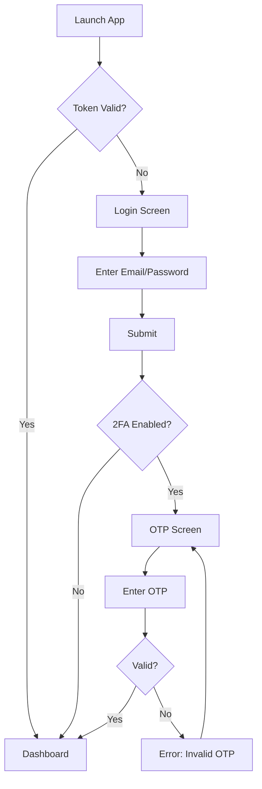
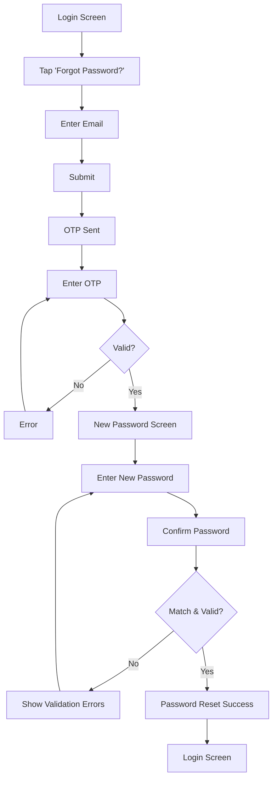
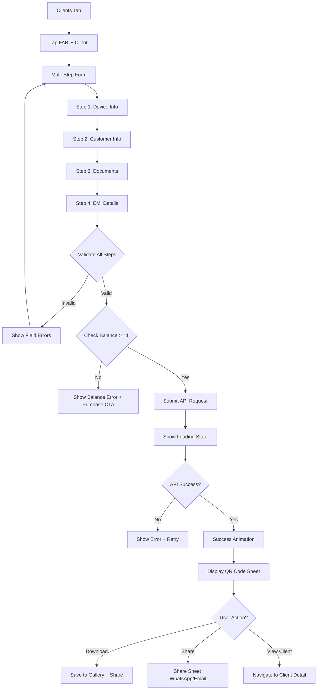

# demiAdmin - Modern User Flows & Screen Specifications

**Design System**: Material Design 3 (Material You)
**Reference**: [UI_DESIGN_MODERN.md](./UI_DESIGN_MODERN.md)

## Table of Contents

1. [Authentication Flows](#1-authentication-flows)
2. [Dashboard Flows](#2-dashboard-flows)
3. [Client Management Flows](#3-client-management-flows)
4. [User Management Flows](#4-user-management-flows)
5. [Order & Balance Flows](#5-order--balance-flows)
6. [Device Control Flows](#6-device-control-flows)
7. [Reports & Analytics Flows](#7-reports--analytics-flows)
8. [Notification Flows](#8-notification-flows)
9. [Profile Management Flows](#9-profile-management-flows)

---

## 1. Authentication Flows

### 1.1 Login Flow



#### Screen: Login Screen

**Route**: `/auth/login`

**Modern Layout** (Material Design 3):

```tsx
// Visual Layout Description
╔═══════════════════════════════════════╗
║                                       ║
║         [App Logo/Icon]               ║  (64x64, primary color)
║                                       ║
║      Welcome to demiAdmin             ║  displaySmall (36sp)
║   Manage devices with confidence      ║  bodyMedium, onSurfaceVariant
║                                       ║
║  ┌─────────────────────────────────┐ ║
║  │ Email                           │ ║  labelMedium (12sp)
║  │ ┌───────────────────────────┐   │ ║
║  │ │ user@company.com         │   │ ║  MD3 Filled TextField (56dp)
║  │ └───────────────────────────┘   │ ║
║  └─────────────────────────────────┘ ║
║                                       ║
║  ┌─────────────────────────────────┐ ║
║  │ Password                        │ ║  labelMedium (12sp)
║  │ ┌───────────────────────────┐   │ ║
║  │ │ ••••••••  [👁]            │   │ ║  MD3 Filled TextField (56dp)
║  │ └───────────────────────────┘   │ ║  with trailing icon
║  └─────────────────────────────────┘ ║
║                                       ║
║         Forgot password?              ║  labelLarge, tertiary color
║                                       ║
║  ┌─────────────────────────────────┐ ║
║  │         Sign In                 │ ║  MD3 Filled Button (40dp height)
║  └─────────────────────────────────┘ ║  Fully rounded, primary color
║                                       ║
║  ─────────── OR ───────────          ║
║                                       ║
║  ┌─────────────────────────────────┐ ║
║  │  [🔐] Sign in with Biometrics   │ ║  MD3 Outlined Button
║  └─────────────────────────────────┘ ║
║                                       ║
╚═══════════════════════════════════════╝
```

**Component Specs**:
- **Container**: `surfaceContainer` background, 16dp horizontal padding
- **Logo**: 64x64dp, `primary` color, centered
- **Title**: `displaySmall` (36sp), `onSurface` color
- **Subtitle**: `bodyMedium` (14sp), `onSurfaceVariant` color
- **Text Fields**: MD3 Filled style, 56dp height, `primaryContainer` background
- **Sign In Button**: Filled button, 40dp height, `primary` background, fully rounded
- **Forgot Password**: Text button, `tertiary` color
- **Biometric Button**: Outlined button, `outline` border

**API Call**:
```typescript
POST /api/v1/auth/login
Body: { email, password }
Response: {
  accessToken,
  refreshToken,
  user: { id, name, email, role },
  requires2FA: boolean
}
```

**Validation**:
- Email: Valid format, required
- Password: Min 8 chars, required
- Show inline error below field on validation fail

**States**:
- **Idle**: Default state
- **Loading**: Show circular progress indicator on button, disable interactions
- **Error**: Show error message in `errorContainer` color below button
- **Success**: Fade out to dashboard with 200ms transition

---

#### Screen: OTP Verification

**Route**: `/auth/verify-otp`

**Modern Layout**:

```tsx
╔═══════════════════════════════════════╗
║  [← Back]                             ║  MD3 IconButton (40x40)
║                                       ║
║                                       ║
║      Verify Your Identity             ║  headlineMedium (28sp)
║                                       ║
║   We sent a 6-digit code to           ║  bodyMedium
║   user@company.com                   ║  bodyLarge, primary color
║                                       ║
║   ┌───────────────────────────────┐  ║
║   │  [1] [2] [3] [4] [5] [6]      │  ║  6 individual inputs
║   │   ▂   ▂   ▂   ▂   ▂   ▂       │  ║  48x48 each, 8dp gap
║   └───────────────────────────────┘  ║  primaryContainer background
║                                       ║
║   ┌─────────────────────────────────┐ ║
║   │         Verify & Continue       │ ║  MD3 Filled Button
║   └─────────────────────────────────┘ ║
║                                       ║
║   Didn't receive the code?            ║  bodySmall
║   Resend OTP (0:45)                   ║  labelLarge, primary (disabled)
║                                       ║
║   ─────────────────────────────────  ║
║   🔒 Your data is secure & encrypted  ║  bodySmall, onSurfaceVariant
║                                       ║
╚═══════════════════════════════════════╝
```

**Component Specs**:
- **OTP Inputs**: 6 boxes, 48x48dp each, 8dp gap, `surfaceContainerHigh` background
- **Active Input**: `primaryContainer` background, `primary` outline (2dp)
- **Verify Button**: Disabled until all 6 digits entered
- **Resend**: Text button, disabled with countdown timer, enabled after 60s
- **Security Note**: Caption with lock icon, `onSurfaceVariant` color

**API Call**:
```typescript
POST /api/v1/auth/verify-2fa
Body: { tempToken, otp }
Response: { accessToken, refreshToken, user }
```

**Logic**:
- Auto-focus first input on mount
- Auto-advance to next input on digit entry
- Auto-submit when all 6 digits filled
- Shake animation on invalid OTP
- Max 5 attempts, then lock for 5 minutes

**Animations**:
- Entrance: Slide in from right (300ms, emphasizedDecelerate)
- Error: Shake animation (200ms)
- Success: Scale up checkmark (250ms)

---

### 1.2 Forgot Password Flow



**Modern Password Reset Screen**:

```tsx
╔═══════════════════════════════════════╗
║  [← Back]                             ║
║                                       ║
║      Reset Your Password              ║  headlineMedium
║                                       ║
║   Create a strong password            ║  bodyMedium
║                                       ║
║  ┌─────────────────────────────────┐ ║
║  │ New Password                    │ ║
║  │ ┌───────────────────────────┐   │ ║
║  │ │ ••••••••  [👁]            │   │ ║  MD3 Outlined TextField
║  │ └───────────────────────────┘   │ ║
║  │ ✓ At least 8 characters         │ ║  Success indicator
║  │ ✓ Contains uppercase             │ ║
║  │ ✗ Contains number                │ ║  Error indicator
║  │ ✗ Contains special character     │ ║
║  └─────────────────────────────────┘ ║
║                                       ║
║  ┌─────────────────────────────────┐ ║
║  │ Confirm Password                │ ║
║  │ ┌───────────────────────────┐   │ ║
║  │ │ ••••••••  [👁]            │   │ ║
║  │ └───────────────────────────┘   │ ║
║  └─────────────────────────────────┘ ║
║                                       ║
║  ┌─────────────────────────────────┐ ║
║  │      Reset Password             │ ║  MD3 Filled Button
║  └─────────────────────────────────┘ ║
║                                       ║
╚═══════════════════════════════════════╝
```

**Password Strength Indicators**:
- Real-time validation with color-coded checkmarks
- ✓ Green (`success.main`) for met requirements
- ✗ Red (`error.main`) for unmet requirements
- Progress bar showing password strength (0-100%)

---

## 2. Dashboard Flows

### 2.1 Role-Based Dashboard

**Route**: `/dashboard`

#### OWNER Dashboard (Modern)

```tsx
╔═══════════════════════════════════════╗
║  ☰  demiAdmin        [🔔] [⚙️] [👤]  ║  MD3 Top App Bar
╠═══════════════════════════════════════╣
║                                       ║  Scrollable content
║  Good morning, John 👋                ║  headlineSmall (24sp)
║  Here's your overview for today       ║  bodyMedium, onSurfaceVariant
║                                       ║
║  ┌───────────────────────────────┐   ║
║  │  ╭─────╮  45 Keys             │   ║  MD3 Elevated Card
║  │  │ 🔑  │  Available            │   ║  12dp border radius
║  │  ╰─────╯  +5 this week        │   ║  elevation.level1
║  └───────────────────────────────┘   ║
║  ┌───────────┐  ┌─────────────────┐  ║
║  │ ╭───╮ 120│  │ ╭───╮   ₹25.4K │  ║  Two-column grid
║  │ │👥 │ CLI│  │ │💰 │   Revenue │  ║  8dp gap
║  │ ╰───╯ -2 │  │ ╰───╯   +12%   │  ║
║  └───────────┘  └─────────────────┘  ║
║                                       ║
║  Active Agents (12)          [View]  ║  titleMedium + text button
║  ┌─────────────────────────────────┐ ║
║  │  ◉ User 1    ₹5,000   10 cli  │ ║  MD3 List Item (72dp)
║  │     Online · Last seen 2m ago   │ ║  Avatar + 2 lines + trailing
║  ├─────────────────────────────────┤ ║
║  │  ◉ User 2    ₹3,000   8 cli   │ ║
║  │     Online · Last seen 5m ago   │ ║
║  └─────────────────────────────────┘ ║
║                                       ║
║  Recent Activity                     ║  titleMedium
║  ┌─────────────────────────────────┐ ║
║  │  ┌─┐ Client created by User 1  │ ║  Timeline style
║  │  │+│ John Doe - Galaxy A52      │ ║
║  │  └─┘ 2 hours ago                │ ║
║  │  ┌─┐ 50 keys purchased           │ ║
║  │  │💰│ Order #1234               │ ║
║  │  └─┘ 3 hours ago                │ ║
║  └─────────────────────────────────┘ ║
║                                       ║
║  Revenue Trend (30 days)             ║  titleMedium
║  ┌─────────────────────────────────┐ ║
║  │      ╱╲    ╱╲                   │ ║  Line chart
║  │    ╱    ╲╱    ╲  ╱              │ ║  react-native-gifted-charts
║  │  ╱              ╲╱               │ ║  primary color gradient
║  │ ┴────────────────────────────┴  │ ║
║  └─────────────────────────────────┘ ║
║                                       ║
╠═══════════════════════════════════════╣
║  [🏠] [👥] [📊] [👤]                 ║  MD3 Navigation Bar (80dp)
╚═══════════════════════════════════════╝
```

**Component Breakdown**:

1. **Top App Bar (MD3 Small)**
   - Height: 64dp
   - Background: `surface`
   - Leading: Hamburger menu icon (navigation drawer)
   - Trailing: Notification badge, Settings, Profile avatar
   - Elevation: level2

2. **KPI Cards**
   - Type: Elevated cards
   - Border radius: 12dp
   - Padding: 16dp
   - Gap between cards: 8dp
   - Icon size: 40x40dp in `primaryContainer`
   - Main number: `headlineSmall` (24sp)
   - Label: `bodyMedium` (14sp), `onSurfaceVariant`
   - Trend: `labelSmall` with arrow, success/error color

3. **User List Items**
   - Type: MD3 Three-line list item
   - Height: 72dp
   - Leading: Avatar (40x40) with online status indicator
   - Primary: User name (`titleMedium`)
   - Secondary: Balance + client count (`bodySmall`)
   - Tertiary: Status (`labelSmall`, `onSurfaceVariant`)

4. **Charts**
   - Library: react-native-gifted-charts
   - Line color: `primary` with gradient fill
   - Height: 200dp
   - Background: `surfaceContainerLow`
   - Border radius: 12dp

**API Call**:
```typescript
GET /api/v1/reports/dashboard
Response: {
  stats: {
    availableKeys: 45,
    keysChange: 5,
    totalClients: 120,
    clientsChange: -2,
    monthlyRevenue: 25400,
    revenueGrowth: 12
  },
  agents: [
    { id, name, avatar, balance, clientCount, status, lastSeen }
  ],
  recentActivity: [
    { id, type, title, subtitle, timestamp, icon }
  ],
  revenueChart: {
    labels: ['Week 1', 'Week 2', ...],
    data: [5000, 7500, ...]
  }
}
```

---

#### AGENT Dashboard (Modern)

```tsx
╔═══════════════════════════════════════╗
║  ☰  demiAdmin        [🔔] [⚙️] [👤]  ║
╠═══════════════════════════════════════╣
║                                       ║
║  Hello, User Name 👋                 ║  headlineSmall
║  Your performance summary             ║  bodyMedium
║                                       ║
║  ┌──────────┐ ┌──────────┐ ┌───────┐ ║
║  │ 🔑 5     │ │ 👥 23    │ │ ✓ 18  │ ║  3-column KPI grid
║  │ Keys     │ │ Clients  │ │ Active│ ║  Compact cards
║  └──────────┘ └──────────┘ └───────┘ ║
║                                       ║
║  Quick Actions                        ║  titleMedium
║  ┌────────────────────────────────┐  ║
║  │  [➕] New Client                │  ║  MD3 Filled Tonal Button
║  │  [🛒] Purchase Keys             │  ║  Stack vertically
║  │  [📊] View Reports              │  ║  12dp gap between
║  └────────────────────────────────┘  ║
║                                       ║
║  My Clients                     [All]║  titleMedium + filter button
║  ┌─────────────────────────────────┐ ║
║  │  ◉ Customer 1        [🔒 Lock] │ ║  Client card with action
║  │  Galaxy A52 · Protected        │ ║
║  │  EMI: 5/12 · ₹1,667 due Jan 15│ ║
║  │  ▰▰▰▰▰▰▰▱▱▱▱▱ 42%             │ ║  Progress bar
║  ├─────────────────────────────────┤ ║
║  │  ◉ Customer 2        [📱 Call] │ ║
║  │  iPhone 12 · Locked            │ ║
║  │  EMI: 2/12 · ₹2,500 OVERDUE   │ ║  Error color
║  │  ▰▰▰▱▱▱▱▱▱▱▱▱ 17%             │ ║
║  └─────────────────────────────────┘ ║
║                                       ║
║  Upcoming Payments              [All]║
║  ┌─────────────────────────────────┐ ║
║  │  ⏰ Tomorrow                    │ ║  Chip indicator
║  │  Customer 1 · ₹1,667            │ ║
║  │  [💳 Mark Paid] [💬 Remind]    │ ║  Action buttons
║  ├─────────────────────────────────┤ ║
║  │  ⚠️ 3 days overdue              │ ║  Warning chip
║  │  Customer 2 · ₹2,500            │ ║
║  │  [🔒 Lock] [💬 Message]        │ ║
║  └─────────────────────────────────┘ ║
║                                       ║
╠═══════════════════════════════════════╣
║  [🏠] [👥] [📊] [👤]                 ║  Bottom Navigation
╚═══════════════════════════════════════╝
```

**Unique Features for User Dashboard**:

1. **Quick Action Buttons**
   - Type: MD3 Filled Tonal buttons
   - Full width, stacked vertically
   - Icon + label, 48dp height
   - `secondaryContainer` background

2. **Client Cards with Inline Actions**
   - Swipeable for quick actions (lock, call, message)
   - EMI progress bar with color coding:
     - Green (On track): 0-7 days until due
     - Orange (Due soon): Due in 1-3 days
     - Red (Overdue): Past due date
   - Status badges with semantic colors

3. **Upcoming Payments Section**
   - Sorted by due date (overdue first)
   - Time-based chips (Tomorrow, This Week, Overdue)
   - Inline action buttons for each payment

---

## 3. Client Management Flows

### 3.1 Create Client Flow (Zero-Touch Provisioning)



#### Step 1: Device Information (Modern)

```tsx
╔═══════════════════════════════════════╗
║  [✕]  Add Client                      ║  MD3 Top App Bar (Center)
║       ▰▰▰▱▱▱▱ Step 1 of 4            ║  Progress indicator
╠═══════════════════════════════════════╣
║                                       ║
║  📱 Device Information                ║  titleLarge with icon
║  Tell us about the device             ║  bodySmall, onSurfaceVariant
║                                       ║
║  ┌─────────────────────────────────┐ ║
║  │ IMEI 1 *                        │ ║  labelMedium
║  │ ┌───────────────────────────┐   │ ║
║  │ │ 123456789012345  [📷]     │   │ ║  MD3 Outlined TextField
║  │ └───────────────────────────┘   │ ║  Trailing: Camera to scan
║  │ 15 digits required               │ ║  Supporting text
║  └─────────────────────────────────┘ ║
║                                       ║
║  ┌─────────────────────────────────┐ ║
║  │ IMEI 2 (Optional)               │ ║
║  │ ┌───────────────────────────┐   │ ║
║  │ │                    [📷]   │   │ ║
║  │ └───────────────────────────┘   │ ║
║  └─────────────────────────────────┘ ║
║                                       ║
║  ┌─────────────────────────────────┐ ║
║  │ Brand *                         │ ║
║  │ ┌───────────────────────────┐   │ ║
║  │ │ Samsung           [▼]     │   │ ║  Dropdown menu
║  │ └───────────────────────────┘   │ ║
║  └─────────────────────────────────┘ ║
║                                       ║
║  ┌─────────────────────────────────┐ ║
║  │ Model *                         │ ║
║  │ ┌───────────────────────────┐   │ ║
║  │ │ Galaxy A52                │   │ ║  Auto-suggest from brand
║  │ └───────────────────────────┘   │ ║
║  └─────────────────────────────────┘ ║
║                                       ║
║  ┌──────────────┐  ┌───────────────┐ ║
║  │ RAM *        │  │ Storage *     │ ║  Two-column layout
║  │ ┌────────┐   │  │ ┌─────────┐  │ ║
║  │ │ 8GB [▼]│   │  │ │128GB [▼]│  │ ║  Dropdown chips
║  │ └────────┘   │  │ └─────────┘  │ ║
║  └──────────────┘  └───────────────┘ ║
║                                       ║
║                                       ║
║  ┌─────────────────────────────────┐ ║
║  │          Next: Customer Info    │ ║  MD3 Filled Button
║  └─────────────────────────────────┘ ║  Bottom sticky
║                                       ║
╚═══════════════════════════════════════╝
```

**Component Features**:

1. **IMEI Input with Camera**
   - MD3 Outlined TextField
   - Trailing icon: Camera button
   - Tapping camera opens scanner overlay
   - Auto-validates format (15 digits)
   - Shows green checkmark when valid

2. **Brand/Model Autocomplete**
   - Dropdown with search
   - Popular brands at top
   - Model auto-suggests based on brand
   - Shows device image preview when selected

3. **RAM/Storage Chips**
   - Horizontal chip group
   - Single selection
   - Common values: 4GB, 6GB, 8GB, 12GB, 16GB
   - Storage: 64GB, 128GB, 256GB, 512GB

4. **Progress Indicator**
   - Linear progress bar below app bar
   - Shows current step (1/4 = 25%)
   - Animated transitions between steps

**Validation**:
- Real-time validation with debounce (500ms)
- Error state: Red outline + error text below field
- Success state: Green checkmark trailing icon
- Required fields: Red asterisk in label

---

#### Step 2: Customer Information (Modern)

```tsx
╔═══════════════════════════════════════╗
║  [←]  Add Client                      ║
║       ▰▰▰▰▰▰▱▱ Step 2 of 4           ║
╠═══════════════════════════════════════╣
║                                       ║
║  👤 Customer Information              ║  titleLarge with icon
║  Who is this device for?              ║  bodySmall
║                                       ║
║      ┌─────────────────┐             ║
║      │                 │             ║
║      │   [📷 Photo]    │             ║  Avatar picker (120x120)
║      │                 │             ║  surfaceContainerHigh bg
║      └─────────────────┘             ║
║      Add Customer Photo *             ║  labelMedium, center
║                                       ║
║  ┌─────────────────────────────────┐ ║
║  │ Full Name *                     │ ║
║  │ ┌───────────────────────────┐   │ ║
║  │ │ John Doe                  │   │ ║  MD3 Outlined TextField
║  │ └───────────────────────────┘   │ ║
║  └─────────────────────────────────┘ ║
║                                       ║
║  ┌─────────────────────────────────┐ ║
║  │ Phone Number 1 *                │ ║
║  │ ┌───────────────────────────┐   │ ║
║  │ │ +91 | 9876543210  [✓]    │   │ ║  Country code + validation
║  │ └───────────────────────────┘   │ ║
║  └─────────────────────────────────┘ ║
║                                       ║
║  ┌─────────────────────────────────┐ ║
║  │ Phone Number 2                  │ ║
║  │ ┌───────────────────────────┐   │ ║
║  │ │ +91 |                     │   │ ║
║  │ └───────────────────────────┘   │ ║
║  └─────────────────────────────────┘ ║
║                                       ║
║  ┌─────────────────────────────────┐ ║
║  │ Email (Optional)                │ ║
║  │ ┌───────────────────────────┐   │ ║
║  │ │ john@example.com          │   │ ║
║  │ └───────────────────────────┘   │ ║
║  └─────────────────────────────────┘ ║
║                                       ║
║  ┌─────────────────────────────────┐ ║
║  │      Next: Upload Documents     │ ║  MD3 Filled Button
║  └─────────────────────────────────┘ ║
║                                       ║
╚═══════════════════════════════════════╝
```

**Photo Picker Features**:
- Tapping opens bottom sheet with 3 options:
  1. 📷 Take Photo (Camera)
  2. 🖼️ Choose from Gallery
  3. 🎨 Choose Avatar Icon (fallback)
- Circular preview (120x120dp)
- Crop to square with zoom/pan
- Compress to max 500KB

**Phone Input Features**:
- Country code dropdown (flag + code)
- Auto-format as user types
- Green checkmark when valid format
- Supports multiple country formats
- Duplicate check between Phone 1 & 2

---

#### Step 3: Document Upload (Modern)

```tsx
╔═══════════════════════════════════════╗
║  [←]  Add Client                      ║
║       ▰▰▰▰▰▰▰▰▰▱ Step 3 of 4         ║
╠═══════════════════════════════════════╣
║                                       ║
║  📄 Upload Documents                  ║  titleLarge
║  Required for KYC verification        ║  bodySmall
║                                       ║
║  Aadhaar Card Front * ║
║  ┌─────────────────────────────────┐ ║
║  │                                 │ ║
║  │         ┌───────────┐           │ ║  Upload zone (empty)
║  │         │  📷 Scan  │           │ ║  Dashed border
║  │         │  or Upload│           │ ║  primaryContainer bg
║  │         └───────────┘           │ ║  120dp height
║  │                                 │ ║
║  │  Tap to capture or select       │ ║
║  └─────────────────────────────────┘ ║
║                                       ║
║  Aadhaar Card Back *                  ║
║  ┌─────────────────────────────────┐ ║
║  │  ✓ aadhar_back.jpg       [✕]   │ ║  Upload success state
║  │  [Preview thumbnail]             │ ║  Green outline
║  │  Uploaded 2s ago · 450KB        │ ║  Trailing: Remove button
║  └─────────────────────────────────┘ ║
║                                       ║
║  Customer Selfie *                    ║
║  ┌─────────────────────────────────┐ ║
║  │        [Live Preview]            │ ║  Camera preview mode
║  │                                 │ ║  Face detection overlay
║  │     [Align face in circle]      │ ║  Guidelines
║  │                                 │ ║
║  │      [⚪ Capture]                │ ║  Capture button
║  └─────────────────────────────────┘ ║
║                                       ║
║  Additional Documents (Optional)      ║
║  ┌─────────────────────────────────┐ ║
║  │  [+ Add Document]               │ ║  MD3 Outlined Button
║  └─────────────────────────────────┘ ║
║                                       ║
║  ℹ️ All documents are encrypted and  ║  Info message
║     stored securely                   ║  bodySmall, tertiary
║                                       ║
║  ┌─────────────────────────────────┐ ║
║  │       Next: EMI Details         │ ║  MD3 Filled Button
║  └─────────────────────────────────┘ ║  Disabled until all required
║                                       ║
╚═══════════════════════════════════════╝
```

**Document Upload States**:

1. **Empty State**
   - Dashed border, `outlineVariant` color
   - Large upload icon (48x48)
   - "Tap to capture or select" text
   - `surfaceContainerLow` background

2. **Uploading State**
   - Solid border, `primary` color
   - Circular progress indicator
   - "Uploading... 45%" text
   - Cancel button in corner

3. **Success State**
   - Solid border, `success` color
   - Checkmark icon (24x24)
   - Thumbnail preview (80x80)
   - File name + size + timestamp
   - Remove button (X icon)

4. **Error State**
   - Solid border, `error` color
   - Error icon (24x24)
   - Error message ("File too large")
   - Retry button

**Selfie Capture Features**:
- Live camera preview
- Face detection with oval overlay
- Auto-capture when face detected & centered
- Flash button for low light
- Switch camera (front/back) button
- Face alignment guidelines

---

#### Step 4: EMI Details (Modern)

```tsx
╔═══════════════════════════════════════╗
║  [←]  Add Client                      ║
║       ▰▰▰▰▰▰▰▰▰▰▰▰ Step 4 of 4       ║
╠═══════════════════════════════════════╣
║                                       ║
║  💰 EMI Details                       ║  titleLarge
║  Set up payment terms                 ║  bodySmall
║                                       ║
║  ┌─────────────────────────────────┐ ║
║  │ Total Device Amount *           │ ║
║  │ ┌───────────────────────────┐   │ ║
║  │ │ ₹ | 25,000                │   │ ║  Currency input
║  │ └───────────────────────────┘   │ ║  Auto-format with commas
║  └─────────────────────────────────┘ ║
║                                       ║
║  ┌─────────────────────────────────┐ ║
║  │ Down Payment *                  │ ║
║  │ ┌───────────────────────────┐   │ ║
║  │ │ ₹ | 5,000                 │   │ ║
║  │ └───────────────────────────┘   │ ║
║  │ Min: ₹2,500 (10%)    Max: 50%  │ ║  Helper text with range
║  └─────────────────────────────────┘ ║
║                                       ║
║  EMI Period *                         ║
║  ┌──────┐ ┌──────┐ ┌──────┐ ┌──────┐ ║
║  │  6   │ │ •12• │ │  18  │ │  24  │ ║  Chip selection
║  │months│ │months│ │months│ │months│ ║  Selected: filled chip
║  └──────┘ └──────┘ └──────┘ └──────┘ ║  Others: outlined
║                                       ║
║  ┌─────────────────────────────────┐ ║
║  │  📊 EMI Breakdown               │ ║  MD3 Filled Card
║  │                                 │ ║  tertiaryContainer bg
║  │  Total Amount:      ₹25,000    │ ║
║  │  Down Payment:      -₹5,000    │ ║
║  │  ───────────────────────────   │ ║
║  │  Finance Amount:    ₹20,000    │ ║  Emphasized
║  │                                 │ ║
║  │  Monthly EMI:       ₹1,667     │ ║  headlineSmall
║  │  Number of EMIs:    × 12       │ ║
║  │                                 │ ║
║  │  Interest Rate:     0% (promo) │ ║  success color
║  │  First Due Date:    Feb 1      │ ║
║  └─────────────────────────────────┘ ║
║                                       ║
║  ⚠️ 1 key will be deducted from your ║  Warning banner
║     balance upon creating this client ║  warningContainer bg
║                                       ║
║  ┌─────────────────────────────────┐ ║
║  │      Create Client & Generate   │ ║  MD3 Filled Button
║  │            QR Code              │ ║  primary, 48dp height
║  └─────────────────────────────────┘ ║
║                                       ║
╚═══════════════════════════════════════╝
```

**EMI Calculator Features**:
- **Live Calculation**: Updates EMI breakdown in real-time
- **Validation**:
  - Down payment must be 10-50% of total
  - Total amount must be ₹5,000 minimum
  - Shows error if insufficient balance
- **Breakdown Card**:
  - Smooth slide-in animation when values change
  - Color-coded: success for 0% interest, warning for interest
  - Shows all calculations transparently

**API Call**:
```typescript
POST /api/v1/clients
Body: {
  // Device Info
  imei1: string
  imei2?: string
  brand: string
  model: string
  ram: string
  storage: string

  // Customer Info
  clientName: string
  clientPhone1: string
  clientPhone2?: string
  clientEmail?: string
  profileImageUrl: string // S3 URL after upload

  // Documents
  documents: {
    aadharFront: string // S3 URL
    aadharBack: string // S3 URL
    selfie: string // S3 URL
    additional?: string[] // S3 URLs
  }

  // EMI Details
  totalAmount: number
  downPayment: number
  numberOfEmi: number
  emiAmount: number
  interestRate: number
  firstDueDate: string // ISO date
}

Response: {
  clientId: string
  uniqueCode: string // For QR
  qrCodeData: string // Base64 encoded QR
  status: 'not_registered' | 'protected'
  createdAt: string
  agentBalance: number // Updated balance
}
```

---

#### Success: QR Code Display (Modern)

```tsx
╔═══════════════════════════════════════╗
║                                       ║
║  ┌─────────────────────────────────┐ ║
║  │                                 │ ║
║  │          ✓                      │ ║  Success animation
║  │    Client Created!              │ ║  Scale up + fade in
║  │                                 │ ║  headlineMedium
║  └─────────────────────────────────┘ ║
║                                       ║
║  ┌─────────────────────────────────┐ ║
║  │                                 │ ║
║  │      ▓▓▓▓▓▓▓▓▓▓▓▓▓▓▓           │ ║  QR Code (240x240)
║  │      ▓▓█████▓▓▓▓▓▓▓▓▓▓▓         │ ║  High contrast
║  │      ▓▓█████▓▓▓▓█████▓▓         │ ║  White on dark theme
║  │      ▓▓█████▓▓▓▓█████▓▓         │ ║  Dark on light theme
║  │      ▓▓▓▓▓▓▓▓▓▓▓█████▓▓         │ ║
║  │      ▓▓▓▓▓▓▓▓▓▓▓▓▓▓▓▓▓▓         │ ║
║  │                                 │ ║
║  └─────────────────────────────────┘ ║
║                                       ║
║  Client: John Doe                     ║  titleMedium
║  Code: DG-JD-1234                     ║  labelLarge, monospace
║                                       ║
║  📱 Setup Instructions                ║  titleSmall
║  ┌─────────────────────────────────┐ ║
║  │  1️⃣ Install DemiProtect app     │ ║  Ordered list
║  │     from Play Store             │ ║  Each step: bodyMedium
║  │                                 │ ║
║  │  2️⃣ Open app and tap "Scan QR" │ ║
║  │                                 │ ║
║  │  3️⃣ Point camera at QR code    │ ║
║  │                                 │ ║
║  │  4️⃣ Device will auto-register  │ ║
║  │                                 │ ║
║  │  ⚠️ Keep app installed always   │ ║
║  └─────────────────────────────────┘ ║
║                                       ║
║  ⏰ QR Code valid for 7 days          ║  Warning chip
║                                       ║
║  ┌─────────────────────────────────┐ ║
║  │  📥 Download QR                 │ ║  MD3 Filled Tonal Button
║  └─────────────────────────────────┘ ║
║                                       ║
║  ┌─────────────────────────────────┐ ║
║  │  📤 Share via WhatsApp          │ ║  MD3 Outlined Button
║  └─────────────────────────────────┘ ║
║                                       ║
║  ┌─────────────────────────────────┐ ║
║  │     View Client Details         │ ║  MD3 Filled Button
║  └─────────────────────────────────┘ ║
║                                       ║
╚═══════════════════════════════════════╝
```

**QR Code Features**:
- **Generation**: Uses `react-native-qrcode-svg`
- **Content**: JSON with client ID + auth token
- **Size**: 240x240dp for scanning
- **Error Correction**: Level H (30% recovery)
- **Theme-aware**: Inverts colors based on theme

**Action Buttons**:

1. **Download QR**
   - Saves as PNG to device gallery
   - Filename: `demiprotect_qr_[clientName]_[date].png`
   - Shows toast: "QR saved to gallery"

2. **Share via WhatsApp**
   - Opens WhatsApp share sheet
   - Pre-filled message template:
     ```
     Hi [Client Name],

     Your device protection is ready!

     📱 Install: bit.ly/demiprotect
     🔒 Scan this QR code to activate

     Keep the app installed for protection.

     - [User Name]
     ```
   - Attaches QR as image

3. **View Client Details**
   - Navigates to client detail screen
   - Passes client ID
   - Closes QR modal with fade animation

---

### 3.2 Client List & Detail

#### Screen: Client List (Modern)

```tsx
╔═══════════════════════════════════════╗
║  ☰  Clients              [🔔] [🔍]   ║  Top App Bar
╠═══════════════════════════════════════╣
║                                       ║
║  ┌─────────────────────────────────┐ ║
║  │ 🔍 Search clients...            │ ║  MD3 Search Bar
║  └─────────────────────────────────┘ ║  56dp height, rounded
║                                       ║
║  [•All•] [Active] [Locked] [Expired] ║  MD3 Filter Chips
║                                       ║  Horizontal scroll
║  23 clients                    [⋮]   ║  bodySmall + menu
║                                       ║
║  ┌─────────────────────────────────┐ ║
║  │  ◉ [IMG] John Doe        [⋮]   │ ║  MD3 Three-line list
║  │  Galaxy A52 · 🟢 Protected     │ ║  72dp height
║  │  EMI: 5/12 · ₹7,500 remaining  │ ║
║  │  ▰▰▰▰▰▰▰▱▱▱▱▱ 42%             │ ║  Inline progress
║  ├─────────────────────────────────┤ ║  Divider (1dp)
║  │  ◉ [IMG] Jane Smith      [⋮]   │ ║
║  │  iPhone 12 · 🔴 Locked         │ ║  Error color
║  │  EMI: 2/12 · 3 days overdue    │ ║
║  │  ▰▰▱▱▱▱▱▱▱▱▱▱ 17%             │ ║
║  ├─────────────────────────────────┤ ║
║  │  ◉ [IMG] Bob Wilson      [⋮]   │ ║
║  │  OnePlus 9 · 🟡 Not Registered │ ║  Warning color
║  │  [View QR Code]                 │ ║  Chip button
║  └─────────────────────────────────┘ ║
║                                       ║
║  Load more...                         ║  Pagination (10/page)
║                                       ║
╠═══════════════════════════════════════╣
║  [🏠] [•👥•] [📊] [👤]               ║  Bottom Nav (Clients active)
╚════════════[FAB: +]======================╝  FAB: Add Client (56x56)
```

**Modern List Features**:

1. **Search Bar (MD3 DockedSearchBar)**
   - Expands on tap to full-screen search
   - Shows recent searches
   - Live filtering with debounce (300ms)
   - Highlights matching text

2. **Filter Chips**
   - Assist chips (not selectable)
   - Show count badge: "Active (18)"
   - Horizontal scroll if overflow
   - Smooth chip transition animation

3. **Client List Items**
   - Avatar (40x40) with status indicator dot
   - Swipe left: Quick actions (Lock, Track, Message)
   - Swipe right: Mark paid, View details
   - Long press: Multi-select mode
   - Status badge with semantic colors

4. **Empty States**:
   - No clients: Large icon + "Add your first client" CTA
   - No search results: "No clients found" + Clear button
   - Filtered empty: "No [status] clients" + change filter

**API Call**:
```typescript
GET /api/v1/clients?
  page=1&
  limit=10&
  status=active&
  search=john&
  sortBy=createdAt&
  sortOrder=desc

Response: {
  clients: [
    {
      id, name, phone, email, profileImageUrl,
      device: { brand, model, imei1, status },
      emi: {
        totalAmount, paid, remaining, nextDue,
        current, total, progress, isOverdue
      },
      status, lastSync, createdAt
    }
  ],
  pagination: { page, limit, total, pages }
}
```

---

#### Screen: Client Detail (Modern)

```tsx
╔═══════════════════════════════════════╗
║  [←]  John Doe           [⋮]         ║  Top App Bar with menu
╠═══════════════════════════════════════╣
║                                       ║  Scrollable content
║  ┌─────────────────────────────────┐ ║
║  │      ╭───────────────╮          │ ║  Hero card
║  │      │  [Customer    │          │ ║  Elevated card
║  │      │   Photo]      │          │ ║  120x120 avatar
║  │      ╰───────────────╯          │ ║
║  │                                 │ ║
║  │      John Doe                   │ ║  headlineSmall (24sp)
║  │      +91 9876543210             │ ║  bodyMedium
║  │      john@example.com           │ ║
║  │                                 │ ║
║  │      ┌─────────────────┐        │ ║
║  │      │ 🟢 Protected    │        │ ║  Status chip (success)
║  │      └─────────────────┘        │ ║
║  └─────────────────────────────────┘ ║
║                                       ║
║  Quick Actions                        ║  titleMedium
║  ┌──────┐ ┌──────┐ ┌──────┐ ┌──────┐ ║
║  │ 🔒   │ │ 📍   │ │ 💬   │ │ 📞   │ ║  Icon buttons grid
║  │ Lock │ │Track │ │ Msg  │ │Call  │ ║  4 columns
║  └──────┘ └──────┘ └──────┘ └──────┘ ║  56x56 each
║                                       ║
║  📱 Device Information                ║  titleMedium
║  ┌─────────────────────────────────┐ ║
║  │  Samsung Galaxy A52             │ ║  MD3 Filled Card
║  │  IMEI: 1234567890123456         │ ║  Monospace font
║  │  RAM: 8GB · Storage: 128GB      │ ║
║  │  ───────────────────────────    │ ║
║  │  Registered: Jan 1, 2024        │ ║  success color
║  │  Last Sync: 5 mins ago          │ ║  bodySmall
║  └─────────────────────────────────┘ ║
║                                       ║
║  💰 EMI Details               [History]║  titleMedium + text button
║  ┌─────────────────────────────────┐ ║
║  │  ▰▰▰▰▰▰▰▱▱▱▱▱ 42% Complete     │ ║  Progress indicator
║  │                                 │ ║
║  │  Paid: 5 of 12 EMIs             │ ║  headlineSmall
║  │  ₹8,333 paid · ₹11,667 due     │ ║  bodyMedium
║  │                                 │ ║
║  │  ┌─────────────────────────┐   │ ║
║  │  │ Next Payment             │   │ ║  Nested card
║  │  │ ₹1,667 · Due Feb 1      │   │ ║  primaryContainer
║  │  │ [💳 Mark as Paid]       │   │ ║  Action button
║  │  └─────────────────────────┘   │ ║
║  │                                 │ ║
║  │  Total Device Amount: ₹25,000  │ ║
║  │  Down Payment: ₹5,000           │ ║
║  │  Monthly EMI: ₹1,667 × 12      │ ║
║  └─────────────────────────────────┘ ║
║                                       ║
║  📋 Documents                   [View]║  titleMedium + action
║  ┌─────────────────────────────────┐ ║
║  │  [📄] Aadhaar Front      [👁]  │ ║  Document list items
║  │  [📄] Aadhaar Back       [👁]  │ ║  Tap to preview
║  │  [📷] Customer Selfie    [👁]  │ ║
║  └─────────────────────────────────┘ ║
║                                       ║
║  📊 Activity Timeline          [All] ║
║  ┌─────────────────────────────────┐ ║
║  │  ● Device locked                │ ║  Timeline view
║  │  │ EMI payment overdue          │ ║  Vertical line
║  │  │ 2 days ago                   │ ║
║  │  │                              │ ║
║  │  ● EMI paid                     │ ║
║  │  │ ₹1,667 received              │ ║
║  │  │ Jan 1, 2024                  │ ║
║  │  │                              │ ║
║  │  ● Client registered            │ ║
║  │    Dec 15, 2023                  │ ║
║  └─────────────────────────────────┘ ║
║                                       ║
╠═══════════════════════════════════════╣
║  [🏠] [👥] [📊] [👤]                 ║  Bottom Nav
╚═══════════════════════════════════════╝
```

**Modern Design Elements**:

1. **Hero Card**
   - Large avatar (120x120)
   - Glassmorphism effect (subtle blur)
   - Gradient background based on status
   - Floating above content (elevation.level2)

2. **Quick Action Grid**
   - 4 icon buttons in a row
   - 56x56 touch targets
   - Icon (24x24) + label below
   - `surfaceContainerHigh` background
   - Ripple effect on press

3. **EMI Progress**
   - Linear progress indicator
   - Color-coded segments:
     - Paid: `success` color
     - Upcoming: `surfaceVariant`
     - Overdue: `error` color
   - Percentage shown as overlay

4. **Activity Timeline**
   - Vertical timeline with dots
   - Color-coded by event type
   - Expandable for full details
   - Infinite scroll pagination

**API Call**:
```typescript
GET /api/v1/clients/:id
Response: {
  client: {
    id, name, phone1, phone2, email, profileImageUrl,
    device: {
      brand, model, imei1, imei2, ram, storage,
      status, registeredAt, lastSyncAt
    },
    emi: {
      totalAmount, downPayment, numberOfEmi, emiAmount,
      paidEmis, remainingAmount, nextDueDate, isOverdue,
      progress // percentage
    },
    documents: [
      { id, type, name, url, uploadedAt }
    ],
    activity: [
      { id, type, title, description, timestamp }
    ],
    status, createdAt, updatedAt
  }
}
```

---

## 4. User Management Flows

### 4.1 Create User (OWNER only) - Modern

```tsx
╔═══════════════════════════════════════╗
║  [✕]  Create User                    ║  Modal overlay
╠═══════════════════════════════════════╣
║                                       ║
║  👤 User Information                 ║  titleLarge
║  Add a new team member                ║  bodySmall
║                                       ║
║      ┌─────────────────┐             ║
║      │   [👤 Avatar]   │             ║  Avatar picker
║      └─────────────────┘             ║  80x80, optional
║                                       ║
║  ┌─────────────────────────────────┐ ║
║  │ Full Name *                     │ ║
║  │ ┌───────────────────────────┐   │ ║
║  │ │ User Name                │   │ ║  MD3 Outlined TextField
║  │ └───────────────────────────┘   │ ║
║  └─────────────────────────────────┘ ║
║                                       ║
║  ┌─────────────────────────────────┐ ║
║  │ Email Address *                 │ ║
║  │ ┌───────────────────────────┐   │ ║
║  │ │ user@company.com         │   │ ║  Auto-validate unique
║  │ └───────────────────────────┘   │ ║
║  └─────────────────────────────────┘ ║
║                                       ║
║  ┌─────────────────────────────────┐ ║
║  │ Phone Number *                  │ ║
║  │ ┌───────────────────────────┐   │ ║
║  │ │ +91 | 9876543210          │   │ ║
║  │ └───────────────────────────┘   │ ║
║  └─────────────────────────────────┘ ║
║                                       ║
║  Role *                               ║  labelMedium
║  ┌──────────┐  ┌──────────────────┐  ║
║  │  AGENT   │  │  ADMIN           │  ║  Radio chips
║  │  •       │  │  ○               │  ║
║  └──────────┘  └──────────────────┘  ║
║                                       ║
║  ┌─────────────────────────────────┐ ║
║  │ Initial Password *              │ ║
║  │ ┌───────────────────────────┐   │ ║
║  │ │ ••••••••  [🎲]  [👁]     │   │ ║  Generate + Show buttons
║  │ └───────────────────────────┘   │ ║
║  │ ✓ Strong password               │ ║  Real-time strength
║  └─────────────────────────────────┘ ║
║                                       ║
║  ┌─────────────────────────────────┐ ║
║  │ Initial Balance (Keys)          │ ║
║  │ ┌───────────────────────────┐   │ ║
║  │ │ 10                 [➕➖]  │   │ ║  Number stepper
║  │ └───────────────────────────┘   │ ║
║  │ Will be deducted from your      │ ║  warning color
║  │ balance (50 keys available)     │ ║
║  └─────────────────────────────────┘ ║
║                                       ║
║  ┌─────────────────────────────────┐ ║
║  │      Create User               │ ║  MD3 Filled Button
║  └─────────────────────────────────┘ ║
║                                       ║
╚═══════════════════════════════════════╝
```

**Validation & Features**:
- Email: Unique check via API (debounced)
- Password: Strength indicator (weak/medium/strong)
- Generate: Creates secure random password (16 chars)
- Balance: Max = owner's current balance
- Role info: Shows permission differences on tap

---

## 5. Device Control Flows

### 5.1 Lock Device (Modern Confirmation)

```tsx
╔═══════════════════════════════════════╗
║                                       ║  Bottom sheet modal
║      🔒 Lock Device?                  ║  headlineMedium
║                                       ║
║  This will immediately lock John      ║  bodyLarge
║  Doe's device. They won't be able     ║
║  to use the phone until unlocked.     ║
║                                       ║
║  ┌─────────────────────────────────┐ ║
║  │ Reason (Optional)               │ ║  MD3 Filled TextField
║  │ ┌───────────────────────────┐   │ ║  Multiline (3 rows)
║  │ │ EMI payment overdue       │   │ ║
║  │ │                           │   │ ║
║  │ └───────────────────────────┘   │ ║
║  └─────────────────────────────────┘ ║
║                                       ║
║  ⚠️ This action is reversible         ║  Info chip
║                                       ║
║  ┌───────────────┐ ┌─────────────────┐║
║  │    Cancel     │ │   Lock Device   │║  Buttons
║  └───────────────┘ └─────────────────┘║  Outlined + Filled
║                                       ║
╚═══════════════════════════════════════╝
```

**Lock Success State**:

```tsx
╔═══════════════════════════════════════╗
║                                       ║
║         ✓                             ║  Success animation
║    Device Locked                      ║  headlineMedium
║                                       ║
║  Command sent successfully            ║  bodyMedium
║  Device will lock on next sync        ║
║                                       ║
║  [Dismiss]                            ║  Text button
║                                       ║
╚═══════════════════════════════════════╝
```

---

This modern UI flows document provides contemporary, Material Design 3-based interfaces that align with the design system. All screens use proper MD3 components, spacing, typography, and color roles for a cohesive, professional look.

**Key Modern Improvements**:
- ✅ Material Design 3 components throughout
- ✅ Proper elevation and surface tints
- ✅ Semantic color usage (success, error, warning)
- ✅ Smooth animations and transitions
- ✅ Touch-friendly 48dp+ targets
- ✅ Accessible contrast ratios (WCAG AA)
- ✅ Glassmorphism and modern visual effects
- ✅ Consistent spacing (4dp grid)
- ✅ Clear visual hierarchy
- ✅ Progressive disclosure (multi-step forms)
