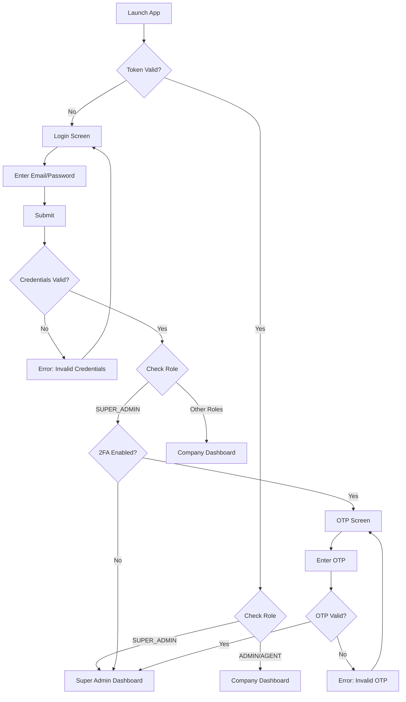
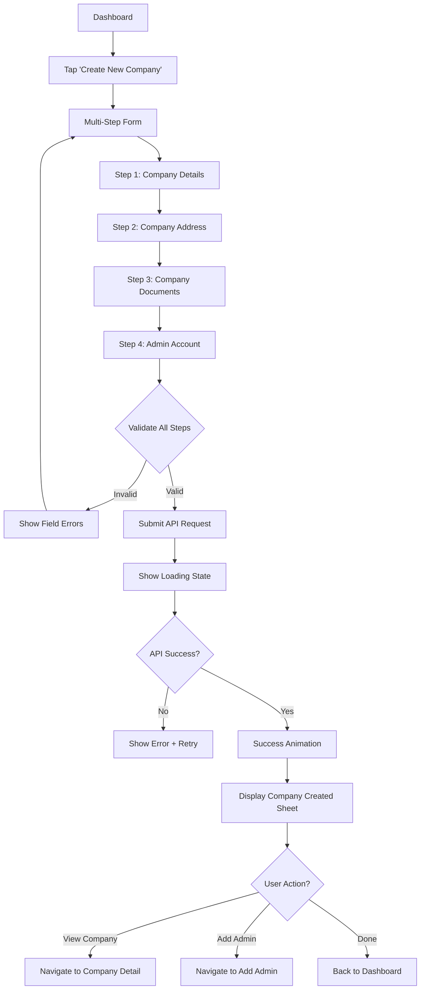
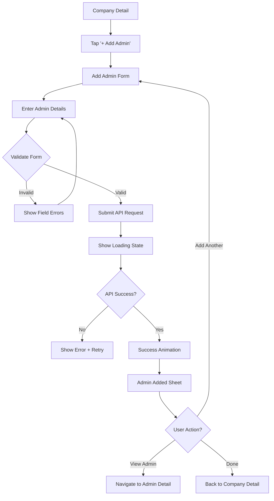

# demiAdmin - Super Admin Flows & Screen Specifications

**Design System**: Material Design 3 (Material You)
**Role**: SUPER_ADMIN
**Reference**: [HLD.md](../../Duetech-service/HLD.md) | [UI_DESIGN_MODERN.md](./UI_DESIGN_MODERN.md)

---

## Table of Contents

1. [Super Admin Authentication](#1-super-admin-authentication)
2. [Super Admin Dashboard](#2-super-admin-dashboard)
   - 2.1 [Dashboard Overview](#21-super-admin-dashboard-overview)
   - 2.2 [Create New User](#22-create-new-user-screen)
3. [Order Management](#3-order-management)
4. [Company Management](#4-company-management)
5. [System Settings](#5-system-settings)
6. [Reports & Analytics](#6-reports--analytics)

---

## 1. Super Admin Authentication

### 1.1 Super Admin Login Flow



---

#### Screen: Super Admin Login

**Route**: `/auth/super-admin-login`

**Modern Layout** (Material Design 3):

```tsx
╔═══════════════════════════════════════╗
║                                       ║
║         [App Logo/Icon]               ║  (64x64, primary color)
║                                       ║
║      Super Admin Access               ║  displaySmall (36sp)
║   System-wide management console      ║  bodyMedium, onSurfaceVariant
║                                       ║
║  ┌─────────────────────────────────┐ ║
║  │ Email                           │ ║  labelMedium (12sp)
║  │ ┌───────────────────────────┐   │ ║
║  │ │ superadmin@demigod.com    │   │ ║  MD3 Filled TextField (56dp)
║  │ └───────────────────────────┘   │ ║
║  └─────────────────────────────────┘ ║
║                                       ║
║  ┌─────────────────────────────────┐ ║
║  │ Password                        │ ║  labelMedium (12sp)
║  │ ┌───────────────────────────┐   │ ║
║  │ │ ••••••••  [👁]            │   │ ║  MD3 Filled TextField (56dp)
║  │ └───────────────────────────┘   │ ║  with trailing icon
║  └─────────────────────────────────┘ ║
║                                       ║
║  ┌─────────────────────────────────┐ ║
║  │         Sign In                 │ ║  MD3 Filled Button (40dp height)
║  └─────────────────────────────────┘ ║  Fully rounded, primary color
║                                       ║
║  🔒 Super Admin accounts require 2FA  ║  Info message
║                                       ║
╚═══════════════════════════════════════╝
```

**Component Specs**:
- **Container**: `surfaceContainer` background, 16dp horizontal padding
- **Logo**: 64x64dp, `primary` color, centered
- **Title**: `displaySmall` (36sp), `onSurface` color
- **Subtitle**: `bodyMedium` (14sp), `onSurfaceVariant` color
- **Text Fields**: MD3 Filled style, 56dp height, `primaryContainer` background
- **Sign In Button**: Filled button, 40dp height, `primary` background, fully rounded
- **Security Note**: Caption with lock icon, `tertiary` color

**API Call**:
```typescript
POST /api/v1/auth/login
Headers: {
  'Content-Type': 'application/json'
}
Body: {
  email: string,
  password: string
}

Response: {
  accessToken?: string, // If 2FA disabled
  tempToken?: string,   // If 2FA enabled
  refreshToken?: string,
  user: {
    id: UUID,
    name: string,
    email: string,
    role: 'SUPER_ADMIN',
    companyId: null
  },
  requires2FA: boolean
}
```

**Validation**:
- Email: Valid format, required
- Password: Min 8 chars, required
- Show inline error below field on validation fail

**States**:
- **Idle**: Default state
- **Loading**: Show circular progress indicator on button, disable interactions
- **Error**: Show error message in `errorContainer` color below button
- **Success**: If 2FA required → Navigate to OTP screen, else → Super Admin Dashboard

---

#### Screen: Super Admin 2FA Verification

**Route**: `/auth/super-admin-verify-otp`

**Modern Layout**:

```tsx
╔═══════════════════════════════════════╗
║  [← Back]                             ║  MD3 IconButton (40x40)
║                                       ║
║                                       ║
║      Super Admin Verification         ║  headlineMedium (28sp)
║                                       ║
║   We sent a 6-digit code to           ║  bodyMedium
║   superadmin@demigod.com              ║  bodyLarge, primary color
║                                       ║
║   ┌───────────────────────────────┐  ║
║   │  [1] [2] [3] [4] [5] [6]      │  ║  6 individual inputs
║   │   ▂   ▂   ▂   ▂   ▂   ▂       │  ║  48x48 each, 8dp gap
║   └───────────────────────────────┘  ║  primaryContainer background
║                                       ║
║   ┌─────────────────────────────────┐ ║
║   │         Verify & Continue       │ ║  MD3 Filled Button
║   └─────────────────────────────────┘ ║
║                                       ║
║   Didn't receive the code?            ║  bodySmall
║   Resend OTP (0:45)                   ║  labelLarge, primary (disabled)
║                                       ║
║   ─────────────────────────────────  ║
║   🔒 Enhanced security for admin access ║  bodySmall, onSurfaceVariant
║                                       ║
╚═══════════════════════════════════════╝
```

**API Call**:
```typescript
POST /api/v1/auth/verify-2fa
Headers: {
  'Content-Type': 'application/json',
  'Authorization': 'Bearer <tempToken>'
}
Body: {
  tempToken: string,
  otp: string
}

Response: {
  accessToken: string,
  refreshToken: string,
  user: {
    id: UUID,
    name: string,
    email: string,
    role: 'SUPER_ADMIN',
    companyId: null
  }
}
```

**Logic**:
- Auto-focus first input on mount
- Auto-advance to next input on digit entry
- Auto-submit when all 6 digits filled
- Shake animation on invalid OTP
- Max 5 attempts, then lock for 5 minutes

---

## 2. Super Admin Dashboard

### 2.1 Super Admin Dashboard Overview

**Route**: `/super-admin/dashboard`

**Focus**: Order management and user creation (company management moved to side nav)

**Modern Layout**:

```tsx
╔═══════════════════════════════════════╗
║  ☰  Super Admin      [🔔] [⚙️] [👤]  ║  MD3 Top App Bar
╠═══════════════════════════════════════╣
║                                       ║  Scrollable content
║  System Overview 🌐                   ║  headlineSmall (24sp)
║  Order management & user creation     ║  bodyMedium, onSurfaceVariant
║                                       ║
║  ┌───────────┐  ┌───────────┐        ║
║  │ ╭───╮ 25 │  │ ╭───╮ 450 │        ║  KPI Cards (2-column)
║  │ │🏢 │ COs │  │ │👥 │Users│        ║  8dp gap
║  │ ╰───╯ +3 │  │ ╰───╯ +12 │        ║
║  └───────────┘  └───────────┘        ║
║  ┌───────────┐  ┌───────────┐        ║
║  │ ╭───╮ 8  │  │ ╭───╮12.5K│        ║
║  │ │📦 │Pend│  │ │👤 │Clnts│        ║
║  │ ╰───╯ Ord│  │ ╰───╯ +250│        ║
║  └───────────┘  └───────────┘        ║
║                                       ║
║  Quick Actions                        ║  titleMedium
║  ┌─────────────────────────────────┐ ║
║  │  [➕] Create New User          │ ║  MD3 Filled Button
║  │  [📊] System Reports            │ ║  Stack vertically
║  │  [⚙️] System Settings           │ ║  12dp gap between
║  └─────────────────────────────────┘ ║
║                                       ║
║  Pending Orders (8)          [Filter]║  titleMedium + filter button
║  ┌─────────────────────────────────┐ ║
║  │  🏢 TechCorp - 100 Keys  [⋮]   │ ║  MD3 List Item (72dp)
║  │     SUPER: John Doe             │ ║  Role + Name
║  │     ₹50,000 · 2 hours ago      │ ║  Amount + Time
║  ├─────────────────────────────────┤ ║
║  │  🏢 MobileCare - 50 Keys [⋮]   │ ║
║  │     SUPER: Jane Smith           │ ║
║  │     ₹25,000 · 5 hours ago      │ ║
║  ├─────────────────────────────────┤ ║
║  │  🏢 DeviceGuard - 200 Keys [⋮] │ ║
║  │     SUPER: Bob Wilson           │ ║
║  │     ₹100,000 · 1 day ago       │ ║  Warning color
║  ├─────────────────────────────────┤ ║
║  │  📋 See All Unprocessed Orders  │ ║  Action row
║  │     (5 more pending)            │ ║  Tap to view all
║  └─────────────────────────────────┘ ║
║                                       ║
║  Recent User Activity                 ║  titleMedium
║  ┌─────────────────────────────────┐ ║
║  │  ┌─┐ New SUPER created          │ ║  Timeline style
║  │  │+│ John Doe @ TechCorp        │ ║
║  │  └─┘ 2 hours ago                │ ║
║  │  ┌─┐ DISTRIBUTOR added          │ ║
║  │  │👤│ Jane @ MobileCare         │ ║
║  │  └─┘ 5 hours ago                │ ║
║  │  ┌─┐ Order approved              │ ║
║  │  │✓│ 100 keys to TechCorp       │ ║
║  │  └─┘ 6 hours ago                │ ║
║  └─────────────────────────────────┘ ║
║                                       ║
║  System Health                        ║  titleMedium
║  ┌─────────────────────────────────┐ ║
║  │  API Status:        🟢 Healthy  │ ║  Status indicators
║  │  Database:          🟢 Healthy  │ ║
║  │  Storage:           🟡 78% used │ ║
║  │  Active Sessions:   342         │ ║
║  └─────────────────────────────────┘ ║
║                                       ║
╠═══════════════════════════════════════╣
║  [🏠] [📦] [📊] [⚙️]                 ║  MD3 Navigation Bar (80dp)
╚═══════════════════════════════════════╝
```

**Component Breakdown**:

1. **KPI Cards**
   - Type: Elevated cards (4 cards in 2x2 grid)
   - Border radius: 12dp
   - Padding: 16dp
   - Gap between cards: 8dp
   - Icon size: 40x40dp in `primaryContainer`
   - Main number: `headlineSmall` (24sp)
   - Label: `bodyMedium` (14sp), `onSurfaceVariant`
   - Trend: `labelSmall` with arrow, success/error color
   - **Cards**: Companies, Users, Pending Orders, Clients

2. **Pending Order List Items**
   - Type: MD3 Three-line list item
   - Height: 72dp
   - Leading: Company logo or icon (40x40)
   - Primary: Company name + order quantity (`titleMedium`)
   - Secondary: Role + user name (`bodySmall`)
   - Tertiary: Amount + time ago (`labelSmall`, `onSurfaceVariant`)
   - Trailing: Menu button (⋮) with Approve/Reject options
   - **Shows**: Recent 3 orders + "See All" row (4th item)

3. **User Activity Timeline**
   - Timeline-style list showing recent user creations and order approvals
   - Icons indicate action type (+ for creation, ✓ for approval)
   - Shows role, name, company, and time
   - Includes order approvals as system activity

4. **System Health Indicators**
   - Color-coded status dots (🟢 green, 🟡 yellow, 🔴 red)
   - Real-time monitoring data
   - Click to view detailed metrics

**API Calls**:
```typescript
GET /api/v1/super-admin/dashboard
Headers: {
  'Authorization': 'Bearer <accessToken>'
}

Response: {
  stats: {
    totalCompanies: 25,
    companiesChange: 3,
    totalUsers: 450,           // All users across all companies
    usersChange: 12,
    pendingOrders: 8,          // Unprocessed orders
    ordersChange: -2,          // Decrease is good
    totalClients: 12500,
    clientsChange: 250
  },
  pendingOrders: [
    {
      id: UUID,
      orderId: string,          // Human-readable ID
      companyId: UUID,
      companyName: string,
      companyLogo: string,
      orderBy: UUID,            // User who placed order
      orderByName: string,
      orderByRole: 'super',     // Always SUPER for SUPER_ADMIN orders
      totalKeys: 100,
      totalAmount: 50000,
      createdAt: timestamp,
      status: 'pending'
    }
  ], // Max 3 items returned
  userActivity: [
    {
      id: UUID,
      type: 'user_created' | 'order_approved' | 'order_rejected',
      userName: string,
      userRole: 'super' | 'distributor' | 'retailer',
      companyName: string,
      details: string,          // e.g., "100 keys to TechCorp"
      timestamp: timestamp,
      icon: string
    }
  ], // Max 5 items
  systemHealth: {
    apiStatus: 'healthy' | 'degraded' | 'down',
    databaseStatus: 'healthy' | 'degraded' | 'down',
    storageUsage: number,       // percentage
    activeSessions: number
  }
}
```

---

### 2.2 Create New User Screen

**Route**: `/super-admin/users/create`

**Purpose**: Create new users (SUPER, DISTRIBUTOR, RETAILER) for any company

**Modern Layout**:

```tsx
╔═══════════════════════════════════════╗
║  [✕]  Create New User                 ║  MD3 Top App Bar (Modal)
╠═══════════════════════════════════════╣
║                                       ║  Scrollable content
║  👤 User Information                  ║  titleLarge
║  Create a new user in the system      ║  bodySmall, onSurfaceVariant
║                                       ║
║  ┌─────────────────────────────────┐ ║
║  │ Select Company *                │ ║  labelMedium
║  │ ┌───────────────────────────┐   │ ║
║  │ │ 🏢 TechCorp Inc      [▼]  │   │ ║  Dropdown with search
║  │ └───────────────────────────┘   │ ║  Shows company logo + name
║  │ User will belong to this company│ ║  Helper text
║  └─────────────────────────────────┘ ║
║                                       ║
║  ┌─────────────────────────────────┐ ║
║  │ Select Role *                   │ ║  labelMedium
║  │ ┌───────────────────────────┐   │ ║
║  │ │ SUPER                [▼]  │   │ ║  Dropdown with 3 options
║  │ └───────────────────────────┘   │ ║
║  │ Defines user's hierarchy level  │ ║  Helper text
║  └─────────────────────────────────┘ ║
║                                       ║
║  ℹ️ Role Description:                 ║  Info panel (dynamic)
║  ┌─────────────────────────────────┐ ║
║  │  SUPER (Level 1):               │ ║  Based on selected role
║  │  • Top-level distributor        │ ║
║  │  • Orders keys from SUPER_ADMIN │ ║
║  │  • Creates DISTRIBUTOR/RETAILER │ ║
║  │  • No parent user               │ ║
║  └─────────────────────────────────┘ ║
║                                       ║
║  ┌─────────────────────────────────┐ ║  (Only if role != SUPER)
║  │ Parent User                     │ ║
║  │ ┌───────────────────────────┐   │ ║
║  │ │ John Doe (SUPER)     [▼]  │   │ ║  Dropdown (filtered by role)
║  │ └───────────────────────────┘   │ ║
║  │ User's immediate supervisor     │ ║
║  └─────────────────────────────────┘ ║
║                                       ║
║      ┌─────────────────┐             ║
║      │   [👤 Avatar]   │             ║  Avatar picker (optional)
║      └─────────────────┘             ║  80x80
║                                       ║
║  ┌─────────────────────────────────┐ ║
║  │ Full Name *                     │ ║
║  │ ┌───────────────────────────┐   │ ║
║  │ │ John Doe                  │   │ ║  MD3 Outlined TextField
║  │ └───────────────────────────┘   │ ║
║  └─────────────────────────────────┘ ║
║                                       ║
║  ┌─────────────────────────────────┐ ║
║  │ Email Address *                 │ ║
║  │ ┌───────────────────────────┐   │ ║
║  │ │ john@techcorp.com     [✓] │   │ ║  Auto-validate unique
║  │ └───────────────────────────┘   │ ║
║  │ Used for login                  │ ║
║  └─────────────────────────────────┘ ║
║                                       ║
║  ┌─────────────────────────────────┐ ║
║  │ Phone Number *                  │ ║
║  │ ┌───────────────────────────┐   │ ║
║  │ │ +91 | 9876543210          │   │ ║  Country code picker
║  │ └───────────────────────────┘   │ ║
║  └─────────────────────────────────┘ ║
║                                       ║
║  ┌─────────────────────────────────┐ ║
║  │ Commission Percentage (%)       │ ║  (Only if parent exists)
║  │ ┌───────────────────────────┐   │ ║
║  │ │ 15.00              [%]    │   │ ║  Number input, 2 decimals
║  │ └───────────────────────────┘   │ ║
║  │ Range: 0-30% (max)              │ ║  Helper text
║  │ Parent earns this on transfers  │ ║
║  └─────────────────────────────────┘ ║
║                                       ║
║  ┌─────────────────────────────────┐ ║
║  │ Initial Password *              │ ║
║  │ ┌───────────────────────────┐   │ ║
║  │ │ ••••••••  [🎲]  [👁]     │   │ ║  Generate + Show
║  │ └───────────────────────────┘   │ ║
║  │ ✓ Strong password               │ ║  Real-time validation
║  │ • Min 8 characters              │ ║
║  │ • Uppercase & lowercase         │ ║
║  │ • Number & special character    │ ║
║  └─────────────────────────────────┘ ║
║                                       ║
║  ┌─────────────────────────────────┐ ║  (Only for SUPER role)
║  │ Initial Balance (Keys)          │ ║
║  │ ┌───────────────────────────┐   │ ║
║  │ │ 100                [➕➖]  │   │ ║  Number stepper
║  │ └───────────────────────────┘   │ ║
║  │ Keys to allocate on creation    │ ║
║  └─────────────────────────────────┘ ║
║                                       ║
║  ☑️ Send welcome email with credentials ║  Checkbox (checked)
║  ☑️ Require 2FA for this user          ║  Checkbox (unchecked)
║                                       ║
║  ┌─────────────────────────────────┐ ║
║  │         Create User             │ ║  MD3 Filled Button
║  └─────────────────────────────────┘ ║  48dp height
║                                       ║
╚═══════════════════════════════════════╝
```

**Role Dropdown Options**:
```typescript
roles: [
  {
    value: 'super',
    label: 'SUPER',
    description: 'Top-level distributor - Orders from SUPER_ADMIN',
    level: 1
  },
  {
    value: 'distributor',
    label: 'DISTRIBUTOR',
    description: 'Mid-tier distributor - Orders from SUPER',
    level: 2
  },
  {
    value: 'retailer',
    label: 'RETAILER',
    description: 'End-tier seller - Creates clients',
    level: 2 or 3 // Can have SUPER or DISTRIBUTOR as parent
  }
]
```

**Parent User Dropdown Logic**:
```typescript
// Parent selection based on role
if (selectedRole === 'super') {
  // No parent needed (null)
  showParentField = false;
} else if (selectedRole === 'distributor') {
  // Parent must be SUPER from same company
  parentOptions = users.filter(u =>
    u.role === 'super' &&
    u.companyId === selectedCompany.id
  );
} else if (selectedRole === 'retailer') {
  // Parent can be SUPER or DISTRIBUTOR from same company
  parentOptions = users.filter(u =>
    (u.role === 'super' || u.role === 'distributor') &&
    u.companyId === selectedCompany.id
  );
}
```

**Validation**:
- Company: Required, must exist
- Role: Required, one of 'super' | 'distributor' | 'retailer'
- Parent User: Required if role != 'super', must be valid based on role rules
- Email: Unique across all users
- Password: Min 8 chars, strong password requirements
- Commission: 0-30%, only shown if parent exists
- Initial Balance: Only for SUPER role, minimum 0

**API Call**:
```typescript
POST /api/v1/super-admin/users
Headers: {
  'Authorization': 'Bearer <accessToken>'
}
Body: {
  companyId: UUID,
  role: 'super' | 'distributor' | 'retailer',
  parentUserId?: UUID,        // null for SUPER, required for others
  name: string,
  email: string,
  phone: string,
  passwordHash: string,       // Hashed on client
  commissionPercentage: number, // 0-30
  balance: number,            // Only for SUPER role, else 0
  profileUrl?: string,
  require2FA: boolean,
  sendWelcomeEmail: boolean
}

Response: {
  user: {
    id: UUID,
    name: string,
    email: string,
    role: 'super' | 'distributor' | 'retailer',
    companyId: UUID,
    companyName: string,
    parentUserId: UUID | null,
    parentUserName: string | null,
    hierarchyLevel: 1 | 2 | 3,
    hierarchyPath: string,
    commissionPercentage: number,
    balance: number,
    status: 'active',
    createdAt: timestamp
  },
  message: 'User created successfully'
}
```

**Success Flow**:
1. Show success animation
2. Display success sheet with user details
3. Show hierarchy path visualization
4. Options: "View User Details", "Create Another", "Done"

---

## 3. Order Management

### 3.1 Pending Orders List

**Route**: `/super-admin/orders/pending`

**Purpose**: View and manage all pending orders from SUPER users

**Modern Layout**:

```tsx
╔═══════════════════════════════════════╗
║  [←]  Pending Orders         [Filter]║  MD3 Top App Bar
╠═══════════════════════════════════════╣
║                                       ║  Scrollable content
║  8 Unprocessed Orders                 ║  headlineSmall (24sp)
║  Awaiting your approval               ║  bodyMedium, onSurfaceVariant
║                                       ║
║  Filters: [•All•] [Today] [This Week] ║  Filter chips
║                                       ║
║  ┌─────────────────────────────────┐ ║
║  │  🏢 TechCorp Inc       [Approve]│ ║  MD3 Elevated Card
║  │  Order #ORD-2026-001            │ ║  12dp border radius
║  │                                 │ ║
║  │  SUPER: John Doe                │ ║  titleMedium
║  │  📧 john@techcorp.com           │ ║  bodySmall
║  │                                 │ ║
║  │  ┌─────────────────────────┐   │ ║
║  │  │ 100 Keys                │   │ ║  Key details
║  │  │ ₹50,000                 │   │ ║  Amount
║  │  │ @ ₹500/key              │   │ ║  Rate
║  │  └─────────────────────────┘   │ ║
║  │                                 │ ║
║  │  🕐 2 hours ago                 │ ║  Time badge
║  │                                 │ ║
║  │  ┌──────────┐  ┌──────────┐    │ ║
║  │  │ Approve  │  │ Reject   │    │ ║  Action buttons
║  │  └──────────┘  └──────────┘    │ ║
║  └─────────────────────────────────┘ ║
║                                       ║
║  ┌─────────────────────────────────┐ ║
║  │  🏢 MobileCare Ltd     [Approve]│ ║
║  │  Order #ORD-2026-002            │ ║
║  │                                 │ ║
║  │  SUPER: Jane Smith              │ ║
║  │  📧 jane@mobilecare.com         │ ║
║  │                                 │ ║
║  │  ┌─────────────────────────┐   │ ║
║  │  │ 50 Keys                 │   │ ║
║  │  │ ₹25,000                 │   │ ║
║  │  │ @ ₹500/key              │   │ ║
║  │  └─────────────────────────┘   │ ║
║  │                                 │ ║
║  │  🕐 5 hours ago                 │ ║
║  │                                 │ ║
║  │  ┌──────────┐  ┌──────────┐    │ ║
║  │  │ Approve  │  │ Reject   │    │ ║
║  │  └──────────┘  └──────────┘    │ ║
║  └─────────────────────────────────┘ ║
║                                       ║
║  ┌─────────────────────────────────┐ ║
║  │  🏢 DeviceGuard Co     [Urgent] │ ║  Red warning badge
║  │  Order #ORD-2026-003            │ ║
║  │                                 │ ║
║  │  SUPER: Bob Wilson              │ ║
║  │  📧 bob@deviceguard.com         │ ║
║  │                                 │ ║
║  │  ┌─────────────────────────┐   │ ║
║  │  │ 200 Keys                │   │ ║
║  │  │ ₹100,000                │   │ ║
║  │  │ @ ₹500/key              │   │ ║
║  │  └─────────────────────────┘   │ ║
║  │                                 │ ║
║  │  🕐 1 day ago                   │ ║  Red text (old order)
║  │                                 │ ║
║  │  ┌──────────┐  ┌──────────┐    │ ║
║  │  │ Approve  │  │ Reject   │    │ ║
║  │  └──────────┘  └──────────┘    │ ║
║  └─────────────────────────────────┘ ║
║                                       ║
╚═══════════════════════════════════════╝
```

**Approve Order Dialog**:

```tsx
╔═══════════════════════════════════════╗
║  Approve Order #ORD-2026-001          ║  Dialog Title
╠═══════════════════════════════════════╣
║                                       ║
║  🏢 TechCorp Inc                      ║
║  SUPER: John Doe                      ║
║                                       ║
║  Order Summary:                       ║  titleMedium
║  • 100 Keys                           ║
║  • Amount: ₹50,000                    ║
║  • Rate: ₹500/key                     ║
║                                       ║
║  ┌─────────────────────────────────┐ ║
║  │ Payment Received?               │ ║  Checkbox
║  │ ☑️ Confirm payment verified     │ ║
║  └─────────────────────────────────┘ ║
║                                       ║
║  ┌─────────────────────────────────┐ ║
║  │ Notes (Optional)                │ ║
║  │ ┌───────────────────────────┐   │ ║
║  │ │ Payment via UPI           │   │ ║  Multiline text
║  │ │ Transaction ID: 12345     │   │ ║
║  │ └───────────────────────────┘   │ ║
║  └─────────────────────────────────┘ ║
║                                       ║
║  ⚠️ This will credit 100 keys to      ║  Warning message
║     John Doe's balance                ║
║                                       ║
║  ┌──────────┐  ┌──────────┐          ║
║  │  Cancel  │  │ Approve  │          ║  Actions
║  └──────────┘  └──────────┘          ║
║                                       ║
╚═══════════════════════════════════════╝
```

**API Calls**:

```typescript
// Get pending orders
GET /api/v1/super-admin/orders/pending
Headers: {
  'Authorization': 'Bearer <accessToken>'
}
Query: {
  page: 1,
  limit: 20,
  filter: 'all' | 'today' | 'this_week'
}

Response: {
  orders: [
    {
      id: UUID,
      orderId: string,
      companyId: UUID,
      companyName: string,
      companyLogo: string,
      orderBy: UUID,
      orderByName: string,
      orderByEmail: string,
      orderByRole: 'super',
      totalKeys: 100,
      ratePerKey: 500,
      totalAmount: 50000,
      status: 'pending',
      createdAt: timestamp,
      ageInHours: number
    }
  ],
  pagination: { page, limit, total, pages }
}

// Approve order
POST /api/v1/super-admin/orders/:id/approve
Headers: {
  'Authorization': 'Bearer <accessToken>'
}
Body: {
  paymentConfirmed: boolean,
  notes?: string
}

Response: {
  order: {
    id: UUID,
    orderId: string,
    status: 'completed',
    completedAt: timestamp
  },
  user: {
    id: UUID,
    name: string,
    balanceBefore: number,
    balanceAfter: number,
    keysAdded: number
  },
  message: 'Order approved and keys credited'
}

// Reject order
POST /api/v1/super-admin/orders/:id/reject
Headers: {
  'Authorization': 'Bearer <accessToken>'
}
Body: {
  reason: string
}

Response: {
  order: {
    id: UUID,
    orderId: string,
    status: 'cancelled',
    cancelledAt: timestamp
  },
  message: 'Order rejected'
}
```

---

## 4. Company Management

### 3.1 Create Company Flow



---

#### Step 1: Company Details (Modern)

**Route**: `/super-admin/companies/create`

```tsx
╔═══════════════════════════════════════╗
║  [✕]  Create Company                  ║  MD3 Top App Bar (Center)
║       ▰▰▰▱▱▱▱ Step 1 of 4            ║  Progress indicator
╠═══════════════════════════════════════╣
║                                       ║
║  🏢 Company Information               ║  titleLarge with icon
║  Basic company details                ║  bodySmall, onSurfaceVariant
║                                       ║
║      ┌─────────────────┐             ║
║      │                 │             ║
║      │  [📷 Logo]      │             ║  Logo picker (120x120)
║      │                 │             ║  surfaceContainerHigh bg
║      └─────────────────┘             ║
║      Add Company Logo *               ║  labelMedium, center
║                                       ║
║  ┌─────────────────────────────────┐ ║
║  │ Company Name *                  │ ║  labelMedium
║  │ ┌───────────────────────────┐   │ ║
║  │ │ TechCorp Inc              │   │ ║  MD3 Outlined TextField
║  │ └───────────────────────────┘   │ ║
║  │ Unique company name             │ ║  Supporting text
║  └─────────────────────────────────┘ ║
║                                       ║
║  ┌─────────────────────────────────┐ ║
║  │ Company Email *                 │ ║
║  │ ┌───────────────────────────┐   │ ║
║  │ │ contact@techcorp.com  [✓] │   │ ║  Auto-validate unique
║  │ └───────────────────────────┘   │ ║
║  │ Used for official communication │ ║
║  └─────────────────────────────────┘ ║
║                                       ║
║  ┌─────────────────────────────────┐ ║
║  │ Company Phone *                 │ ║
║  │ ┌───────────────────────────┐   │ ║
║  │ │ +91 | 9876543210  [✓]    │   │ ║  Country code + validation
║  │ └───────────────────────────┘   │ ║
║  └─────────────────────────────────┘ ║
║                                       ║
║  ┌─────────────────────────────────┐ ║
║  │ Contact Number (Optional)       │ ║
║  │ ┌───────────────────────────┐   │ ║
║  │ │ +91 | 9876543211         │   │ ║
║  │ └───────────────────────────┘   │ ║
║  └─────────────────────────────────┘ ║
║                                       ║
║  ┌─────────────────────────────────┐ ║
║  │ Tag Line (Optional)             │ ║
║  │ ┌───────────────────────────┐   │ ║
║  │ │ Your trusted device partner│  │ ║  Max 500 chars
║  │ └───────────────────────────┘   │ ║
║  └─────────────────────────────────┘ ║
║                                       ║
║  ┌─────────────────────────────────┐ ║
║  │ Commission Percentage (%)       │ ║
║  │ ┌───────────────────────────┐   │ ║
║  │ │ 5                      [%] │  │ ║  Number input
║  │ └───────────────────────────┘   │ ║
║  │ Default: 0% (range: 0-50%)      │ ║  Helper text
║  └─────────────────────────────────┘ ║
║                                       ║
║  ┌─────────────────────────────────┐ ║
║  │      Next: Company Address      │ ║  MD3 Filled Button
║  └─────────────────────────────────┘ ║  Bottom sticky
║                                       ║
╚═══════════════════════════════════════╝
```

**Validation**:
- Company Name: Unique check via API (debounced), 3-255 chars
- Email: Valid format + unique check
- Phone: Valid format for country code
- Commission: 0-50%, decimal allowed
- Logo: Optional, max 2MB, JPG/PNG only

---

#### Step 2: Company Address (Modern)

```tsx
╔═══════════════════════════════════════╗
║  [←]  Create Company                  ║
║       ▰▰▰▰▰▰▱▱ Step 2 of 4           ║
╠═══════════════════════════════════════╣
║                                       ║
║  📍 Company Address                   ║  titleLarge with icon
║  Where is the company located?        ║  bodySmall
║                                       ║
║  ┌─────────────────────────────────┐ ║
║  │ Street Address                  │ ║
║  │ ┌───────────────────────────┐   │ ║
║  │ │ 123 Main Street           │   │ ║  MD3 Outlined TextField
║  │ └───────────────────────────┘   │ ║
║  └─────────────────────────────────┘ ║
║                                       ║
║  ┌─────────────────────────────────┐ ║
║  │ City *                          │ ║
║  │ ┌───────────────────────────┐   │ ║
║  │ │ Mumbai                    │   │ ║  Auto-suggest cities
║  │ └───────────────────────────┘   │ ║
║  └─────────────────────────────────┘ ║
║                                       ║
║  ┌──────────────┐  ┌───────────────┐ ║
║  │ State *      │  │ Postal Code * │ ║  Two-column layout
║  │ ┌────────┐   │  │ ┌─────────┐  │ ║
║  │ │Maharashtra│  │ │ │400001  │  │ ║  Dropdown + input
║  │ └────────┘   │  │ └─────────┘  │ ║
║  └──────────────┘  └───────────────┘ ║
║                                       ║
║  ┌─────────────────────────────────┐ ║
║  │ Country *                       │ ║
║  │ ┌───────────────────────────┐   │ ║
║  │ │ India            [▼]      │   │ ║  Dropdown with flags
║  │ └───────────────────────────┘   │ ║
║  └─────────────────────────────────┘ ║
║                                       ║
║  Location Coordinates (Optional)      ║  labelMedium
║  ┌──────────────┐  ┌───────────────┐ ║
║  │ Latitude     │  │ Longitude     │ ║
║  │ ┌────────┐   │  │ ┌─────────┐  │ ║
║  │ │19.0760 │   │  │ │72.8777  │  │ ║  Decimal inputs
║  │ └────────┘   │  │ └─────────┘  │ ║
║  └──────────────┘  └───────────────┘ ║
║  [📍 Use Current Location]            ║  Text button
║                                       ║
║  ┌─────────────────────────────────┐ ║
║  │      Next: Upload Documents     │ ║  MD3 Filled Button
║  └─────────────────────────────────┘ ║
║                                       ║
╚═══════════════════════════════════════╝
```

**Features**:
- City/State autocomplete from database
- Use Current Location: Fetches GPS + reverse geocode
- All fields stored in `addresses` table

---

#### Step 3: Company Documents (Modern)

```tsx
╔═══════════════════════════════════════╗
║  [←]  Create Company                  ║
║       ▰▰▰▰▰▰▰▰▰▱ Step 3 of 4         ║
╠═══════════════════════════════════════╣
║                                       ║
║  📄 Company Documents                 ║  titleLarge
║  Required for verification            ║  bodySmall
║                                       ║
║  Business Registration *              ║
║  ┌─────────────────────────────────┐ ║
║  │                                 │ ║
║  │         ┌───────────┐           │ ║  Upload zone (empty)
║  │         │  📄 Upload│           │ ║  Dashed border
║  │         │  Document │           │ ║  primaryContainer bg
║  │         └───────────┘           │ ║  120dp height
║  │                                 │ ║
║  │  Tap to select PDF/JPG/PNG      │ ║
║  └─────────────────────────────────┘ ║
║                                       ║
║  Tax Certificate (GST) *              ║
║  ┌─────────────────────────────────┐ ║
║  │  ✓ gst_certificate.pdf   [✕]   │ ║  Upload success state
║  │  Uploaded 2s ago · 850KB        │ ║  Green outline
║  └─────────────────────────────────┘ ║
║                                       ║
║  Business License                     ║
║  ┌─────────────────────────────────┐ ║
║  │                                 │ ║
║  │  📤 Uploading... 45%            │ ║  Upload in progress
║  │  [Progress bar]                 │ ║  Primary color
║  │  [Cancel]                        │ ║
║  └─────────────────────────────────┘ ║
║                                       ║
║  Additional Documents (Optional)      ║
║  ┌─────────────────────────────────┐ ║
║  │  [+ Add Document]               │ ║  MD3 Outlined Button
║  └─────────────────────────────────┘ ║
║                                       ║
║  Document Types:                      ║
║  • Registration certificate           ║  bodySmall list
║  • Tax documents (GST/PAN)            ║
║  • Business license                   ║
║  • Incorporation documents            ║
║                                       ║
║  ┌─────────────────────────────────┐ ║
║  │       Next: Admin Account       │ ║  MD3 Filled Button
║  └─────────────────────────────────┘ ║  Disabled until required docs
║                                       ║
╚═══════════════════════════════════════╝
```

**Upload Features**:
- Supported formats: PDF, JPG, PNG
- Max file size: 5MB per document
- Auto-upload to S3 with progress
- Virus scanning before upload
- All docs stored in `company_documents` table

---

#### Step 4: Admin Account (Modern)

```tsx
╔═══════════════════════════════════════╗
║  [←]  Create Company                  ║
║       ▰▰▰▰▰▰▰▰▰▰▰▰ Step 4 of 4       ║
╠═══════════════════════════════════════╣
║                                       ║
║  👤 Admin Account                     ║  titleLarge
║  Create the first admin (Admin)       ║  bodySmall
║                                       ║
║      ┌─────────────────┐             ║
║      │   [👤 Avatar]   │             ║  Avatar picker
║      └─────────────────┘             ║  80x80, optional
║                                       ║
║  ┌─────────────────────────────────┐ ║
║  │ Full Name *                     │ ║
║  │ ┌───────────────────────────┐   │ ║
║  │ │ John Doe (Admin)          │   │ ║  MD3 Outlined TextField
║  │ └───────────────────────────┘   │ ║
║  └─────────────────────────────────┘ ║
║                                       ║
║  ┌─────────────────────────────────┐ ║
║  │ Email Address *                 │ ║
║  │ ┌───────────────────────────┐   │ ║
║  │ │ Admin@techcorp.com    [✓] │   │ ║  Auto-validate unique
║  │ └───────────────────────────┘   │ ║
║  │ Used for login                  │ ║  Helper text
║  └─────────────────────────────────┘ ║
║                                       ║
║  ┌─────────────────────────────────┐ ║
║  │ Phone Number *                  │ ║
║  │ ┌───────────────────────────┐   │ ║
║  │ │ +91 | 9876543210          │   │ ║
║  │ └───────────────────────────┘   │ ║
║  └─────────────────────────────────┘ ║
║                                       ║
║  ┌─────────────────────────────────┐ ║
║  │ FRP Email (Optional)            │ ║
║  │ ┌───────────────────────────┐   │ ║
║  │ │ frp@techcorp.com          │   │ ║  Factory Reset Protection
║  │ └───────────────────────────┘   │ ║
║  │ For device factory reset        │ ║
║  └─────────────────────────────────┘ ║
║                                       ║
║  ┌─────────────────────────────────┐ ║
║  │ Initial Password *              │ ║
║  │ ┌───────────────────────────┐   │ ║
║  │ │ ••••••••  [🎲]  [👁]     │   │ ║  Generate + Show buttons
║  │ └───────────────────────────┘   │ ║
║  │ ✓ Strong password               │ ║  Real-time strength
║  │ • Min 8 characters              │ ║  Requirements list
║  │ • Uppercase & lowercase         │ ║
║  │ • Number & special character    │ ║
║  └─────────────────────────────────┘ ║
║                                       ║
║  Role: Admin (Fixed)                  ║  Info chip, non-editable
║                                       ║
║  ℹ️ Admin will have full access to    ║  Info message
║     company settings and management   ║  tertiaryContainer bg
║                                       ║
║  ┌─────────────────────────────────┐ ║
║  │      Create Company & Admin     │ ║  MD3 Filled Button
║  └─────────────────────────────────┘ ║  primary, 48dp height
║                                       ║
╚═══════════════════════════════════════╝
```

**Validation**:
- Email: Unique check across all agents
- Password: Meet all security requirements (HLD §5.1)
- Phone: Valid format
- Role: Automatically set to 'Admin'

**API Call**:
```typescript
POST /api/v1/super-admin/companies
Headers: {
  'Authorization': 'Bearer <accessToken>'
}
Body: {
  // Step 1: Company Details
  name: string,
  email: string,
  phone: string,
  contactNumber?: string,
  tagLine?: string,
  logo?: string, // S3 URL
  commissionPer: number,

  // Step 2: Address
  address: {
    street?: string,
    city: string,
    state: string,
    country: string,
    postalCode: string,
    latitude?: number,
    longitude?: number
  },

  // Step 3: Documents
  documents: [
    {
      documentType: 'registration' | 'tax' | 'license',
      documentUrl: string, // S3 URL
      documentName: string
    }
  ],

  // Step 4: Admin Account
  Admin: {
    name: string,
    email: string,
    phone: string,
    frpEmail?: string,
    passwordHash: string, // Hashed on client
    profileUrl?: string,
    role: 'Admin' // Auto-set
  }
}

Response: {
  company: {
    id: UUID,
    name: string,
    email: string,
    status: 'active',
    totalAgents: 1,
    createdAt: timestamp
  },
  Admin: {
    id: UUID,
    name: string,
    email: string,
    role: 'Admin',
    companyId: UUID
  },
  message: 'Company and Admin created successfully'
}
```

---

#### Success: Company Created (Modern)

```tsx
╔═══════════════════════════════════════╗
║                                       ║
║  ┌─────────────────────────────────┐ ║
║  │                                 │ ║
║  │          ✓                      │ ║  Success animation
║  │    Company Created!             │ ║  Scale up + fade in
║  │                                 │ ║  headlineMedium
║  └─────────────────────────────────┘ ║
║                                       ║
║  ┌─────────────────────────────────┐ ║
║  │  🏢 TechCorp Inc                │ ║  Company info card
║  │                                 │ ║  Elevated card
║  │  Admin: John Doe                │ ║  bodyMedium
║  │  Email: Admin@techcorp.com      │ ║
║  │  Status: Active                 │ ║  success color
║  │                                 │ ║
║  │  Created: Jan 10, 2026          │ ║  bodySmall
║  └─────────────────────────────────┘ ║
║                                       ║
║  📧 Credentials sent to Admin's email ║  Info chip
║                                       ║
║  Next Steps:                          ║  titleSmall
║  • Admin can login and set up company ║
║  • Add more admins and agents         ║
║  • Configure company settings         ║
║                                       ║
║  ┌─────────────────────────────────┐ ║
║  │     View Company Details        │ ║  MD3 Filled Button
║  └─────────────────────────────────┘ ║
║                                       ║
║  ┌─────────────────────────────────┐ ║
║  │          Add Admin              │ ║  MD3 Filled Tonal Button
║  └─────────────────────────────────┘ ║
║                                       ║
║  ┌─────────────────────────────────┐ ║
║  │        Back to Dashboard        │ ║  MD3 Outlined Button
║  └─────────────────────────────────┘ ║
║                                       ║
╚═══════════════════════════════════════╝
```

---

### 3.2 Company List & Management

#### Screen: Company List (Super Admin)

**Route**: `/super-admin/companies`

```tsx
╔═══════════════════════════════════════╗
║  ☰  Companies            [🔔] [🔍]   ║  Top App Bar
╠═══════════════════════════════════════╣
║                                       ║
║  ┌─────────────────────────────────┐ ║
║  │ 🔍 Search companies...          │ ║  MD3 Search Bar
║  └─────────────────────────────────┘ ║  56dp height, rounded
║                                       ║
║  [•All•] [Active] [Inactive]          ║  MD3 Filter Chips
║                                       ║  Horizontal scroll
║  25 companies                  [⋮]   ║  bodySmall + menu
║                                       ║
║  ┌─────────────────────────────────┐ ║
║  │  🏢 [LOGO] TechCorp Inc   [⋮]  │ ║  MD3 Three-line list
║  │  125 agents · 2,500 clients     │ ║  72dp height
║  │  Active · Last sync 2h ago      │ ║
║  │  Commission: 5% · ₹2.5L revenue │ ║
║  ├─────────────────────────────────┤ ║  Divider
║  │  🏢 [LOGO] MobileCare Ltd  [⋮]  │ ║
║  │  80 agents · 1,800 clients      │ ║
║  │  Active · Last sync 5h ago      │ ║
║  │  Commission: 3% · ₹1.8L revenue │ ║
║  ├─────────────────────────────────┤ ║
║  │  🏢 [LOGO] DeviceGuard    [⋮]  │ ║
║  │  45 agents · 890 clients        │ ║
║  │  ⚠️ Inactive · 2 days ago       │ ║  Warning color
║  │  Commission: 0% · ₹0 revenue    │ ║
║  └─────────────────────────────────┘ ║
║                                       ║
║  Load more...                         ║  Pagination (10/page)
║                                       ║
╠═══════════════════════════════════════╣
║  [🏠] [•🏢•] [📊] [⚙️]               ║  Bottom Nav
╚════════════[FAB: +]======================╝  FAB: Create Company
```

**List Features**:
- Tap company → Company detail screen
- Menu (⋮) options:
  - View Details
  - Edit Company
  - View Admins
  - Add Admin
  - Deactivate/Activate
  - View Reports
- Swipe actions: Edit, Deactivate, View Stats
- Long press: Multi-select mode

**API Call**:
```typescript
GET /api/v1/super-admin/companies?
  page=1&
  limit=10&
  status=active&
  search=tech&
  sortBy=createdAt&
  sortOrder=desc

Response: {
  companies: [
    {
      id: UUID,
      name: string,
      email: string,
      phone: string,
      logo: string,
      status: 'active' | 'inactive',
      totalAgents: number,
      totalActiveCustomers: number,
      totalBalance: number,
      commissionPer: number,
      monthlyRevenue: number,
      lastActivity: timestamp,
      createdAt: timestamp
    }
  ],
  pagination: { page, limit, total, pages }
}
```

---

## 4. Company Details & Admin Management

### 4.1 Company Detail Screen

**Route**: `/super-admin/companies/:id`

```tsx
╔═══════════════════════════════════════╗
║  [←]  TechCorp Inc       [⋮]         ║  Top App Bar with menu
╠═══════════════════════════════════════╣
║                                       ║  Scrollable content
║  ┌─────────────────────────────────┐ ║
║  │      ╭───────────────╮          │ ║  Hero card
║  │      │  [Company     │          │ ║  Elevated card
║  │      │   Logo]       │          │ ║  120x120 logo
║  │      ╰───────────────╯          │ ║
║  │                                 │ ║
║  │      TechCorp Inc               │ ║  headlineSmall (24sp)
║  │      contact@techcorp.com       │ ║  bodyMedium
║  │      +91 9876543210             │ ║
║  │                                 │ ║
║  │      ┌─────────────────┐        │ ║
║  │      │ 🟢 Active       │        │ ║  Status chip (success)
║  │      └─────────────────┘        │ ║
║  └─────────────────────────────────┘ ║
║                                       ║
║  Quick Actions                        ║  titleMedium
║  ┌──────┐ ┌──────┐ ┌──────┐ ┌──────┐ ║
║  │ ✏️   │ │ 👥   │ │ 📊   │ │ ⚙️   │ ║  Icon buttons grid
║  │ Edit │ │Admins│ │Report│ │ Set  │ ║  4 columns
║  └──────┘ └──────┘ └──────┘ └──────┘ ║  56x56 each
║                                       ║
║  📊 Company Statistics                ║  titleMedium
║  ┌─────────────────────────────────┐ ║
║  │  Total Agents:         125      │ ║  MD3 Filled Card
║  │  Active Customers:     2,500    │ ║
║  │  Total Balance:        ₹5.2L    │ ║
║  │  Commission Rate:      5%       │ ║
║  │  Monthly Revenue:      ₹2.5L    │ ║
║  │  ───────────────────────────    │ ║
║  │  Created: Jan 1, 2024           │ ║  bodySmall
║  │  Last Active: 2 hours ago       │ ║
║  └─────────────────────────────────┘ ║
║                                       ║
║  📍 Address                           ║  titleMedium
║  ┌─────────────────────────────────┐ ║
║  │  123 Main Street                │ ║
║  │  Mumbai, Maharashtra 400001     │ ║
║  │  India                          │ ║
║  │                                 │ ║
║  │  [📍 View on Map]               │ ║  Text button
║  └─────────────────────────────────┘ ║
║                                       ║
║  👥 Admins (5)               [+ Add] ║  titleMedium + FAB
║  ┌─────────────────────────────────┐ ║
║  │  ◉ John Doe (Admin)       [⋮]  │ ║  MD3 List Item
║  │     Admin@techcorp.com          │ ║  Avatar + 2 lines
║  │     Active · 125 clients        │ ║
║  ├─────────────────────────────────┤ ║
║  │  ◉ Jane Smith (Admin)     [⋮]  │ ║
║  │     admin@techcorp.com          │ ║
║  │     Active · 80 clients         │ ║
║  ├─────────────────────────────────┤ ║
║  │  ◉ Bob Wilson (User)     [⋮]  │ ║
║  │     user@techcorp.com          │ ║
║  │     Active · 45 clients         │ ║
║  └─────────────────────────────────┘ ║
║                                       ║
║  📄 Documents (3)             [View] ║  titleMedium + action
║  ┌─────────────────────────────────┐ ║
║  │  [📄] Business Registration [👁]│ ║  Document list items
║  │  [📄] GST Certificate       [👁]│ ║  Tap to preview
║  │  [📄] Business License      [👁]│ ║
║  └─────────────────────────────────┘ ║
║                                       ║
║  📈 Revenue Trend (Last 6 Months)    ║  titleMedium
║  ┌─────────────────────────────────┐ ║
║  │      ╱╲    ╱╲                   │ ║  Line chart
║  │    ╱    ╲╱    ╲  ╱              │ ║  react-native-gifted-charts
║  │  ╱              ╲╱               │ ║  primary color gradient
║  │ ┴────────────────────────────┴  │ ║
║  └─────────────────────────────────┘ ║
║                                       ║
╠═══════════════════════════════════════╣
║  [🏠] [🏢] [📊] [⚙️]                 ║  Bottom Nav
╚═══════════════════════════════════════╝
```

**API Call**:
```typescript
GET /api/v1/super-admin/companies/:id
Headers: {
  'Authorization': 'Bearer <accessToken>'
}

Response: {
  company: {
    id: UUID,
    name: string,
    email: string,
    phone: string,
    contactNumber: string,
    logo: string,
    tagLine: string,
    commissionPer: number,
    status: 'active' | 'inactive',
    totalBalance: number,
    totalAgents: number,
    totalActiveCustomers: number,
    monthlyRevenue: number,
    address: {
      street: string,
      city: string,
      state: string,
      country: string,
      postalCode: string,
      latitude: number,
      longitude: number
    },
    createdAt: timestamp,
    updatedAt: timestamp,
    lastActivity: timestamp
  },
  admins: [
    {
      id: UUID,
      name: string,
      email: string,
      role: 'Admin' | 'admin' | 'user',
      status: 'active' | 'inactive',
      activeClients: number,
      balance: number,
      lastLoginAt: timestamp
    }
  ],
  documents: [
    {
      id: UUID,
      documentType: string,
      documentUrl: string,
      documentName: string,
      uploadedAt: timestamp,
      status: 'pending' | 'verified' | 'rejected'
    }
  ],
  revenueChart: {
    labels: ['Jul', 'Aug', 'Sep', 'Oct', 'Nov', 'Dec'],
    data: [50000, 75000, 65000, 90000, 120000, 250000]
  }
}
```

---

### 4.2 Add Admin to Company Flow



---

#### Screen: Add Admin to Company

**Route**: `/super-admin/companies/:id/admins/create`

```tsx
╔═══════════════════════════════════════╗
║  [✕]  Add Admin to TechCorp           ║  Modal overlay
╠═══════════════════════════════════════╣
║                                       ║
║  👤 Admin Information                 ║  titleLarge
║  Add a new admin/user to company     ║  bodySmall
║                                       ║
║      ┌─────────────────┐             ║
║      │   [👤 Avatar]   │             ║  Avatar picker
║      └─────────────────┘             ║  80x80, optional
║                                       ║
║  ┌─────────────────────────────────┐ ║
║  │ Full Name *                     │ ║
║  │ ┌───────────────────────────┐   │ ║
║  │ │ Admin Name                │   │ ║  MD3 Outlined TextField
║  │ └───────────────────────────┘   │ ║
║  └─────────────────────────────────┘ ║
║                                       ║
║  ┌─────────────────────────────────┐ ║
║  │ Email Address *                 │ ║
║  │ ┌───────────────────────────┐   │ ║
║  │ │ admin@techcorp.com    [✓] │   │ ║  Auto-validate unique
║  │ └───────────────────────────┘   │ ║
║  └─────────────────────────────────┘ ║
║                                       ║
║  ┌─────────────────────────────────┐ ║
║  │ Phone Number *                  │ ║
║  │ ┌───────────────────────────┐   │ ║
║  │ │ +91 | 9876543210          │   │ ║
║  │ └───────────────────────────┘   │ ║
║  └─────────────────────────────────┘ ║
║                                       ║
║  Role *                               ║  labelMedium
║  ┌──────────┐  ┌──────────────────┐  ║
║  │  ADMIN   │  │  AGENT           │  ║  Radio chips
║  │  •       │  │  ○               │  ║
║  └──────────┘  └──────────────────┘  ║
║                                       ║
║  ℹ️ Role Permissions:                 ║  Info expansion panel
║  ┌─────────────────────────────────┐ ║
║  │  ADMIN:                         │ ║  Collapsible
║  │  • Manage agents and clients    │ ║
║  │  • View reports                 │ ║
║  │  • Cannot modify company        │ ║
║  │                                 │ ║
║  │  AGENT:                         │ ║
║  │  • Manage own clients only      │ ║
║  │  • Purchase keys                │ ║
║  │  • Limited reports access       │ ║
║  └─────────────────────────────────┘ ║
║                                       ║
║  ┌─────────────────────────────────┐ ║
║  │ FRP Email (Optional)            │ ║
║  │ ┌───────────────────────────┐   │ ║
║  │ │ frp@techcorp.com          │   │ ║  Factory Reset Protection
║  │ └───────────────────────────┘   │ ║
║  └─────────────────────────────────┘ ║
║                                       ║
║  ┌─────────────────────────────────┐ ║
║  │ Initial Password *              │ ║
║  │ ┌───────────────────────────┐   │ ║
║  │ │ ••••••••  [🎲]  [👁]     │   │ ║  Generate + Show buttons
║  │ └───────────────────────────┘   │ ║
║  │ ✓ Strong password               │ ║  Real-time strength
║  └─────────────────────────────────┘ ║
║                                       ║
║  ┌─────────────────────────────────┐ ║
║  │ Initial Balance (Keys)          │ ║
║  │ ┌───────────────────────────┐   │ ║
║  │ │ 10                 [➕➖]  │   │ ║  Number stepper
║  │ └───────────────────────────┘   │ ║
║  │ From company's available balance│ ║  info color
║  │ (Company balance: 500 keys)     │ ║
║  └─────────────────────────────────┘ ║
║                                       ║
║  ☑️ Send welcome email with credentials ║  Checkbox
║                                       ║
║  ┌─────────────────────────────────┐ ║
║  │      Add Admin to Company       │ ║  MD3 Filled Button
║  └─────────────────────────────────┘ ║
║                                       ║
╚═══════════════════════════════════════╝
```

**Validation**:
- Email: Unique check across all agents
- Password: Meet security requirements (HLD §5.1)
- Phone: Valid format
- Balance: Max = company's current balance
- Role: admin or user only (Admin cannot be added)

**API Call**:
```typescript
POST /api/v1/super-admin/companies/:companyId/admins
Headers: {
  'Authorization': 'Bearer <accessToken>'
}
Body: {
  name: string,
  email: string,
  phone: string,
  frpEmail?: string,
  role: 'admin' | 'user',
  passwordHash: string, // Hashed on client
  balance: number,
  profileUrl?: string,
  sendWelcomeEmail: boolean
}

Response: {
  admin: {
    id: UUID,
    name: string,
    email: string,
    role: 'admin' | 'user',
    companyId: UUID,
    balance: number,
    status: 'active',
    createdAt: timestamp
  },
  company: {
    id: UUID,
    name: string,
    totalAgents: number // Updated count
  },
  message: 'Admin added successfully'
}
```

---

#### Success: Admin Added

```tsx
╔═══════════════════════════════════════╗
║                                       ║
║  ┌─────────────────────────────────┐ ║
║  │                                 │ ║
║  │          ✓                      │ ║  Success animation
║  │      Admin Added!               │ ║  Scale up + fade in
║  │                                 │ ║  headlineMedium
║  └─────────────────────────────────┘ ║
║                                       ║
║  ┌─────────────────────────────────┐ ║
║  │  👤 Admin Name                  │ ║  Admin info card
║  │                                 │ ║  Elevated card
║  │  Role: Admin                    │ ║  bodyMedium
║  │  Email: admin@techcorp.com      │ ║
║  │  Balance: 10 keys               │ ║
║  │                                 │ ║
║  │  Added to: TechCorp Inc         │ ║  bodySmall
║  └─────────────────────────────────┘ ║
║                                       ║
║  ✓ Welcome email sent successfully    ║  Success chip
║                                       ║
║  Next Steps:                          ║  titleSmall
║  • Admin can login with credentials   ║
║  • Start managing clients             ║
║  • Purchase more keys as needed       ║
║                                       ║
║  ┌─────────────────────────────────┐ ║
║  │        Add Another Admin        │ ║  MD3 Filled Tonal Button
║  └─────────────────────────────────┘ ║
║                                       ║
║  ┌─────────────────────────────────┐ ║
║  │      Back to Company            │ ║  MD3 Outlined Button
║  └─────────────────────────────────┘ ║
║                                       ║
╚═══════════════════════════════════════╝
```

---

## 5. System Settings

### 5.1 Super Admin Settings

**Route**: `/super-admin/settings`

```tsx
╔═══════════════════════════════════════╗
║  [←]  System Settings                 ║  Top App Bar
╠═══════════════════════════════════════╣
║                                       ║
║  ⚙️ System Configuration              ║  titleLarge
║                                       ║
║  General Settings                     ║  titleMedium
║  ┌─────────────────────────────────┐ ║
║  │  Default Commission Rate (%)    │ ║  List item
║  │  5%                        [>]  │ ║  Tap to edit
║  ├─────────────────────────────────┤ ║
║  │  Minimum Key Order Size         │ ║
║  │  10 keys                   [>]  │ ║
║  ├─────────────────────────────────┤ ║
║  │  Key Price (per unit)           │ ║
║  │  ₹500                      [>]  │ ║
║  └─────────────────────────────────┘ ║
║                                       ║
║  Security Settings                    ║  titleMedium
║  ┌─────────────────────────────────┐ ║
║  │  Require 2FA for Super Admins   │ ║
║  │                          [🟢 ON]│ ║  Switch
║  ├─────────────────────────────────┤ ║
║  │  Session Timeout (minutes)      │ ║
║  │  30 min                    [>]  │ ║
║  ├─────────────────────────────────┤ ║
║  │  Max Login Attempts             │ ║
║  │  5 attempts                [>]  │ ║
║  └─────────────────────────────────┘ ║
║                                       ║
║  Notification Settings                ║  titleMedium
║  ┌─────────────────────────────────┐ ║
║  │  Email Notifications            │ ║
║  │                          [🟢 ON]│ ║
║  ├─────────────────────────────────┤ ║
║  │  SMS Notifications              │ ║
║  │                          [⚪ OFF]│ ║
║  ├─────────────────────────────────┤ ║
║  │  Push Notifications             │ ║
║  │                          [🟢 ON]│ ║
║  └─────────────────────────────────┘ ║
║                                       ║
║  Data & Storage                       ║  titleMedium
║  ┌─────────────────────────────────┐ ║
║  │  Database Backup Schedule       │ ║
║  │  Daily at 2:00 AM          [>]  │ ║
║  ├─────────────────────────────────┤ ║
║  │  Storage Usage                  │ ║
║  │  ▰▰▰▰▰▰▰▰▱▱ 78% (256GB/328GB) │ ║  Progress bar
║  ├─────────────────────────────────┤ ║
║  │  Log Retention Period           │ ║
║  │  90 days                   [>]  │ ║
║  └─────────────────────────────────┘ ║
║                                       ║
║  Danger Zone                          ║  titleMedium, error color
║  ┌─────────────────────────────────┐ ║
║  │  [🗄️] Export All Data           │ ║  errorContainer bg
║  │  [🔄] Reset System Stats        │ ║  Destructive actions
║  │  [⚠️] Maintenance Mode          │ ║
║  └─────────────────────────────────┘ ║
║                                       ║
╠═══════════════════════════════════════╣
║  [🏠] [🏢] [📊] [•⚙️•]               ║  Bottom Nav
╚═══════════════════════════════════════╝
```

---

## 6. Reports & Analytics

### 6.1 System-Wide Reports

**Route**: `/super-admin/reports`

```tsx
╔═══════════════════════════════════════╗
║  [←]  System Reports                  ║  Top App Bar
╠═══════════════════════════════════════╣
║                                       ║
║  📊 Analytics Overview                ║  titleLarge
║                                       ║
║  Time Range: [Last 30 Days ▼]         ║  Dropdown filter
║                                       ║
║  ┌───────────┐  ┌───────────┐        ║
║  │ ₹12.5M    │  │ 25        │        ║  KPI cards
║  │ Revenue   │  │ Companies │        ║
║  │ +15% ↗    │  │ +3 ↗      │        ║
║  └───────────┘  └───────────┘        ║
║  ┌───────────┐  ┌───────────┐        ║
║  │ 450       │  │ 12.5K     │        ║
║  │ Agents    │  │ Clients   │        ║
║  │ +12 ↗     │  │ +250 ↗    │        ║
║  └───────────┘  └───────────┘        ║
║                                       ║
║  Revenue Trend                        ║  titleMedium
║  ┌─────────────────────────────────┐ ║
║  │      ╱╲    ╱╲                   │ ║  Line chart
║  │    ╱    ╲╱    ╲  ╱              │ ║
║  │  ╱              ╲╱               │ ║
║  │ ┴────────────────────────────┴  │ ║
║  └─────────────────────────────────┘ ║
║                                       ║
║  Top Companies by Revenue             ║  titleMedium
║  ┌─────────────────────────────────┐ ║
║  │  1. TechCorp Inc       ₹2.5M    │ ║  Leaderboard style
║  │  2. MobileCare Ltd     ₹1.8M    │ ║
║  │  3. DeviceGuard Co     ₹1.2M    │ ║
║  │  4. SecurePhone Inc    ₹890K    │ ║
║  │  5. GuardTech Ltd      ₹750K    │ ║
║  └─────────────────────────────────┘ ║
║                                       ║
║  Client Growth by Company             ║  titleMedium
║  ┌─────────────────────────────────┐ ║
║  │       ▁▂▃▅▇ Bar Chart           │ ║  Bar chart
║  │  █████████████                  │ ║
║  │  TechCorp  Mobile  Device       │ ║
║  └─────────────────────────────────┘ ║
║                                       ║
║  [📥 Export Report]                   ║  MD3 Filled Tonal Button
║                                       ║
╠═══════════════════════════════════════╣
║  [🏠] [🏢] [•📊•] [⚙️]               ║  Bottom Nav
╚═══════════════════════════════════════╝
```

**API Call**:
```typescript
GET /api/v1/super-admin/reports/overview?
  startDate=2025-12-01&
  endDate=2026-01-10

Headers: {
  'Authorization': 'Bearer <accessToken>'
}

Response: {
  summary: {
    totalRevenue: 12500000,
    revenueGrowth: 15,
    totalCompanies: 25,
    companiesGrowth: 3,
    totalAgents: 450,
    agentsGrowth: 12,
    totalClients: 12500,
    clientsGrowth: 250
  },
  revenueChart: {
    labels: ['Week 1', 'Week 2', 'Week 3', 'Week 4'],
    data: [2500000, 3000000, 3500000, 3500000]
  },
  topCompanies: [
    {
      id: UUID,
      name: 'TechCorp Inc',
      revenue: 2500000,
      clients: 2500,
      agents: 125
    }
  ],
  clientGrowthByCompany: {
    labels: ['TechCorp', 'MobileCare', 'DeviceGuard'],
    data: [250, 180, 120]
  }
}
```

---

## Authentication & Authorization Summary

### Role-Based Access Control (RBAC)

**Super Admin Role (`SUPER_ADMIN`)**:
- No `companyId` (system-wide access)
- Cannot be created through normal registration
- Must be manually created in database or via seed script
- Has access to all companies and system-wide operations

**Permissions**:
```typescript
SUPER_ADMIN can:
- ✅ View all companies
- ✅ Create new companies
- ✅ Edit any company details
- ✅ Deactivate/activate companies
- ✅ Add admins to any company
- ✅ View all agents across companies
- ✅ View all clients across companies
- ✅ Access system-wide reports
- ✅ Configure system settings
- ✅ View audit logs
- ❌ Cannot delete companies (soft delete only)
- ❌ Cannot perform user-specific operations (create clients, etc.)
```

### Guard Implementation

**RolesGuard** (src/common/guards/roles.guard.ts):
```typescript
// Super Admin check (line 35-37)
if (user.role === UserRole.SUPER_ADMIN) {
  return true; // SuperAdmin can access everything
}
```

**Usage in Controllers**:
```typescript
// Super Admin only endpoints
@UseGuards(JwtAuthGuard, RolesGuard)
@Roles(UserRole.SUPER_ADMIN)
@Post('companies')
async createCompany(@Body() dto: CreateCompanyDto) {
  // Only SUPER_ADMIN can access
}

// Super Admin + Admin
@UseGuards(JwtAuthGuard, RolesGuard)
@Roles(UserRole.SUPER_ADMIN, UserRole.Admin)
@Get('companies/:id')
async getCompany(@Param('id') id: string) {
  // SUPER_ADMIN or Admin can access
}
```

---

## Navigation Structure

### Bottom Navigation (Super Admin)

```typescript
[
  {
    route: '/super-admin/dashboard',
    icon: '🏠',
    label: 'Dashboard',
    badge: null
  },
  {
    route: '/super-admin/companies',
    icon: '🏢',
    label: 'Companies',
    badge: companiesCount
  },
  {
    route: '/super-admin/reports',
    icon: '📊',
    label: 'Reports',
    badge: null
  },
  {
    route: '/super-admin/settings',
    icon: '⚙️',
    label: 'Settings',
    badge: null
  }
]
```

### Navigation Drawer (Super Admin)

```typescript
[
  { type: 'header', title: 'Super Admin' },
  { route: '/super-admin/dashboard', icon: '🏠', label: 'Dashboard' },
  { route: '/super-admin/companies', icon: '🏢', label: 'Companies' },
  { route: '/super-admin/reports', icon: '📊', label: 'Reports' },
  { type: 'divider' },
  { type: 'header', title: 'System' },
  { route: '/super-admin/settings', icon: '⚙️', label: 'Settings' },
  { route: '/super-admin/audit-logs', icon: '📜', label: 'Audit Logs' },
  { route: '/super-admin/system-health', icon: '💚', label: 'System Health' },
  { type: 'divider' },
  { route: '/profile', icon: '👤', label: 'Profile' },
  { action: 'logout', icon: '🚪', label: 'Logout' }
]
```

---

## Key Differences from Regular Flows

| Feature | Regular User | Super Admin |
|---------|--------------|-------------|
| **Login** | Email + Password + 2FA (optional) | Email + Password + 2FA (required) |
| **Dashboard** | Company-specific stats | System-wide stats (all companies) |
| **Companies** | Access only their company | View/manage all companies |
| **Agents** | Create agents in their company | Add admins to any company |
| **Clients** | Manage clients via agents | View all clients (read-only) |
| **Reports** | Company-specific reports | System-wide analytics |
| **Settings** | Company settings | System configuration |
| **Navigation** | 4 tabs (Home, Clients, Reports, Profile) | 4 tabs (Dashboard, Companies, Reports, Settings) |

---

## Implementation Notes

### 1. Super Admin Creation (Manual)
```sql
-- Create super admin directly in database
INSERT INTO agents (
  id,
  name,
  email,
  passwordHash, -- bcrypt hash of password
  role,
  status,
  companyId -- NULL for super admin
) VALUES (
  'uuid-here',
  'Super Admin',
  'superadmin@demigod.com',
  '$2b$10$hashed-password',
  'SUPER_ADMIN',
  'active',
  NULL
);
```

### 2. API Routes Structure
```typescript
// Super Admin routes (prefix: /api/v1/super-admin)
/super-admin
  /dashboard              GET   - System overview
  /companies              GET   - List all companies
  /companies              POST  - Create company
  /companies/:id          GET   - Company details
  /companies/:id          PUT   - Update company
  /companies/:id/admins   POST  - Add admin to company
  /companies/:id/admins   GET   - List company admins
  /reports/overview       GET   - System-wide reports
  /settings               GET   - Get system settings
  /settings               PUT   - Update system settings
```

### 3. Frontend Route Protection
```typescript
// React Navigation with role-based screens
const SuperAdminStack = () => (
  <Stack.Navigator>
    <Stack.Screen name="Dashboard" component={SuperAdminDashboard} />
    <Stack.Screen name="Companies" component={CompanyList} />
    <Stack.Screen name="CompanyDetail" component={CompanyDetail} />
    <Stack.Screen name="CreateCompany" component={CreateCompany} />
    <Stack.Screen name="AddAdmin" component={AddAdmin} />
    <Stack.Screen name="Reports" component={SystemReports} />
    <Stack.Screen name="Settings" component={SystemSettings} />
  </Stack.Navigator>
);

// Role-based navigation
const AppNavigator = () => {
  const { user } = useAuth();

  if (user.role === 'SUPER_ADMIN') {
    return <SuperAdminStack />;
  } else {
    return <CompanyStack />;
  }
};
```

---

This comprehensive document covers all Super Admin flows with modern Material Design 3 UI specifications, API endpoints, validation rules, and implementation guidance.
