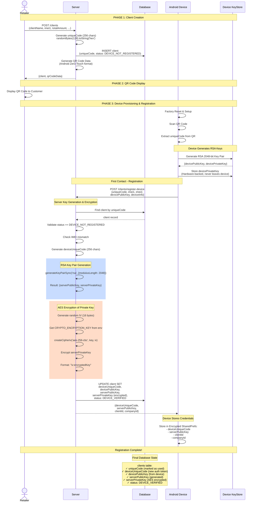
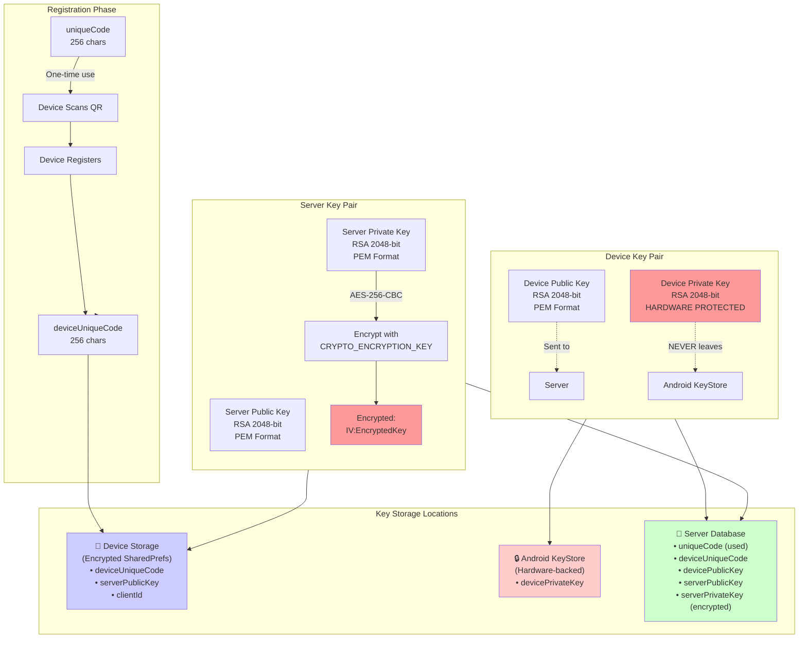
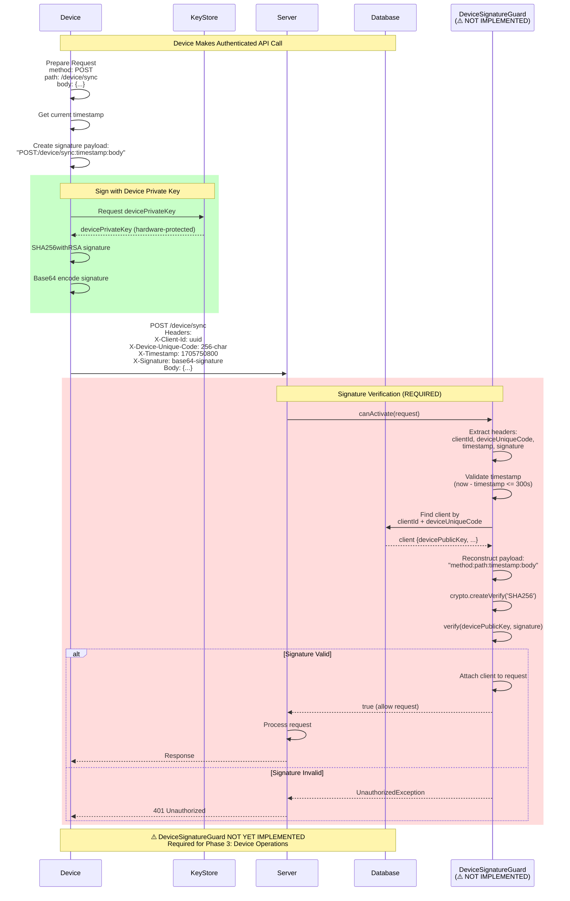
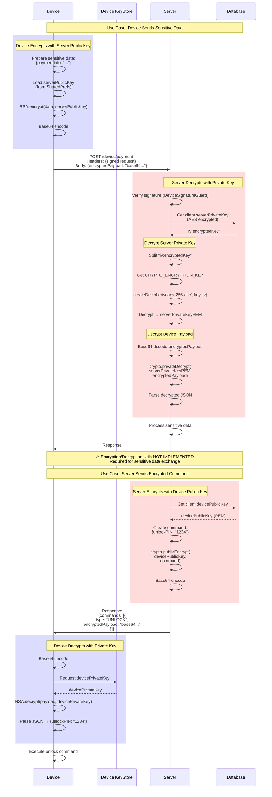
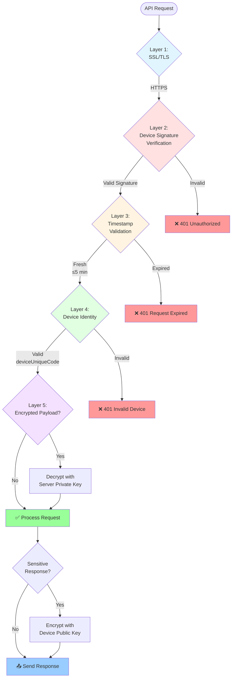
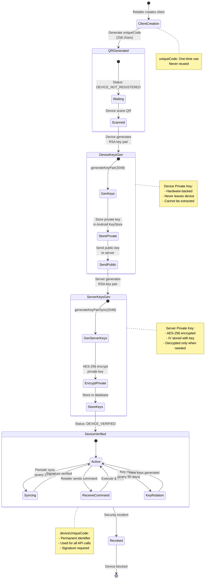
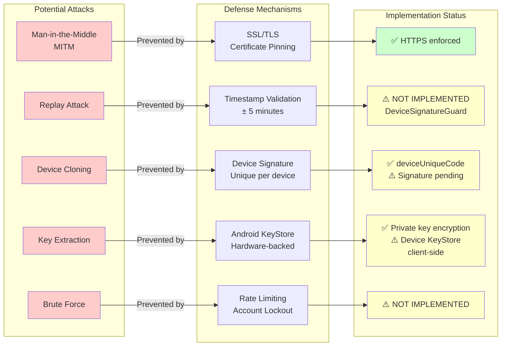

# DEMIGOD Cryptographic Flow - Mermaid Diagrams

## Diagram 1: Complete Registration Flow with Key Exchange

---

## Diagram 2: Key Material Flow & Storage

---

## Diagram 3: Authenticated API Call with RSA Signature

---

## Diagram 4: Encrypted Payload Exchange

---

## Diagram 5: Security Layers Overview

---

## Diagram 6: Key Lifecycle Management

---

## Diagram 7: Attack Prevention Mechanisms

---

## Summary of Diagrams

1. **Diagram 1** - Complete flow from client creation to device registration
2. **Diagram 2** - Key material generation and storage locations
3. **Diagram 3** - Authenticated API call with RSA signature verification
4. **Diagram 4** - Encrypted payload exchange (bidirectional)
5. **Diagram 5** - Security layers for request processing
6. **Diagram 6** - Key lifecycle from generation to rotation
7. **Diagram 7** - Attack vectors and defense mechanisms

---

## Next Steps for Implementation

### Critical Tasks (Phase 3)

1. **Implement DeviceSignatureGuard** (`src/common/guards/device-signature.guard.ts`)
2. **Create Crypto Utilities** (`src/common/utils/crypto.utils.ts`)
3. **Add Encrypted Payload Support** in DeviceCommandService
4. **Implement Replay Attack Prevention** (Redis-based timestamp tracking)

### Testing Required

- Unit tests for signature verification
- Integration tests for full encrypted flow
- Security penetration testing
- Key rotation workflow testing
