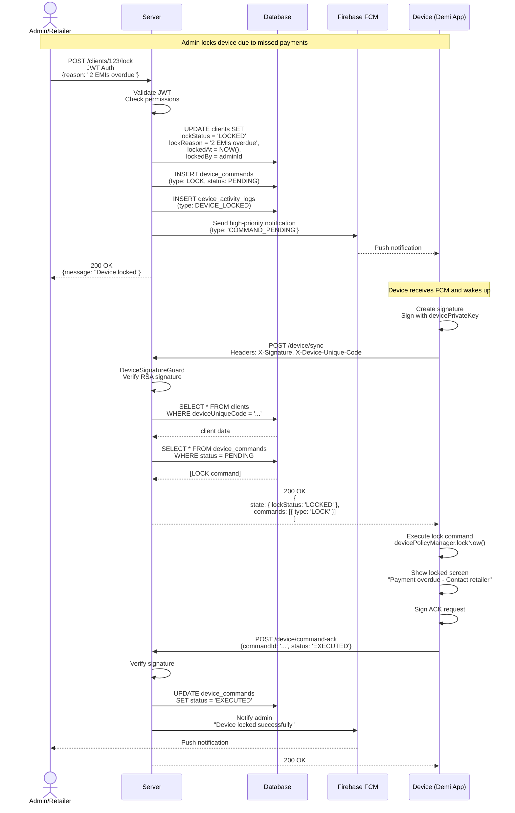
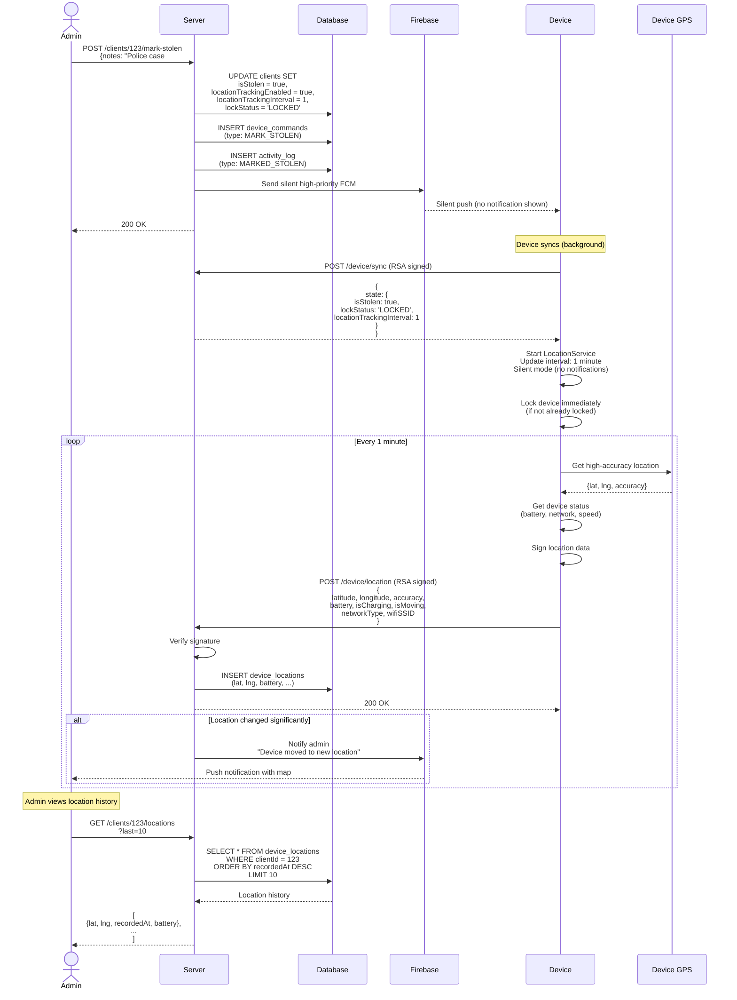
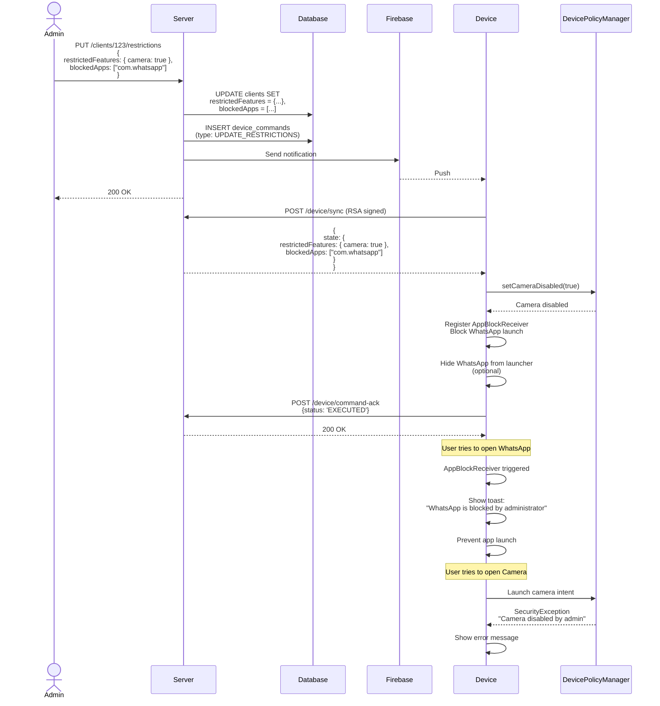
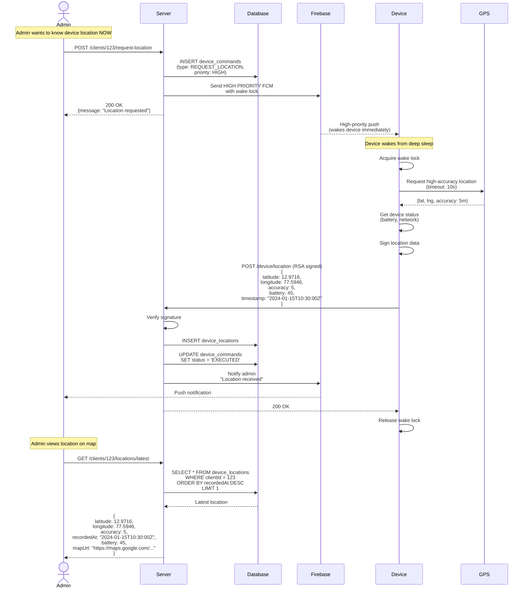
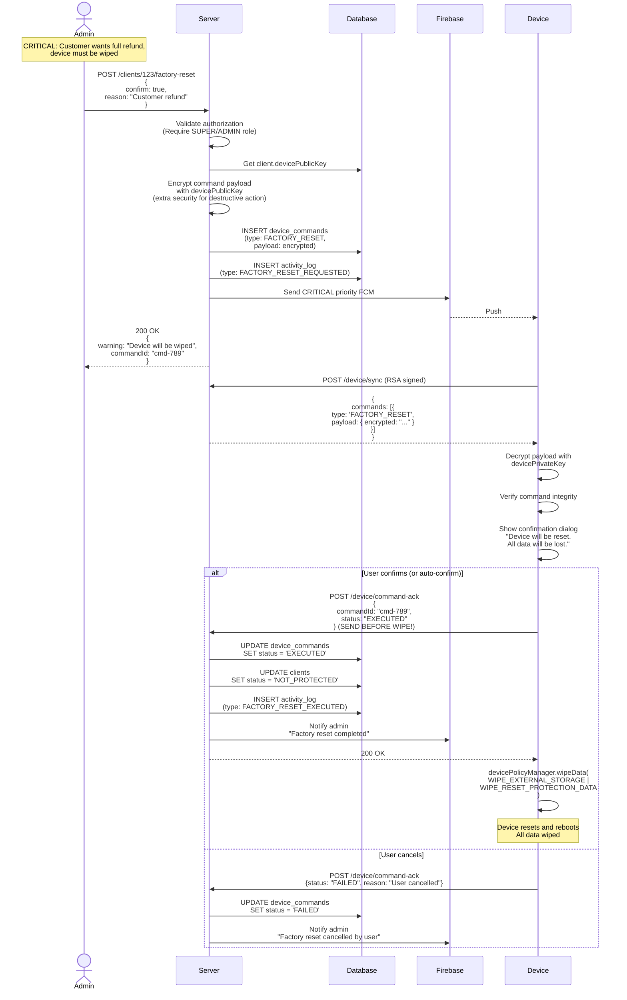
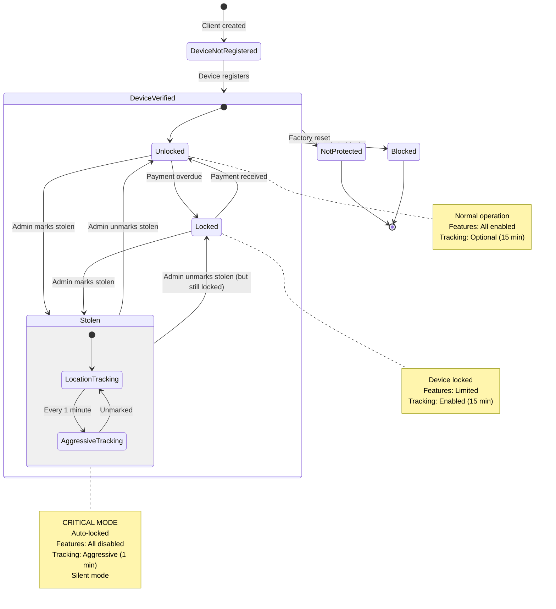
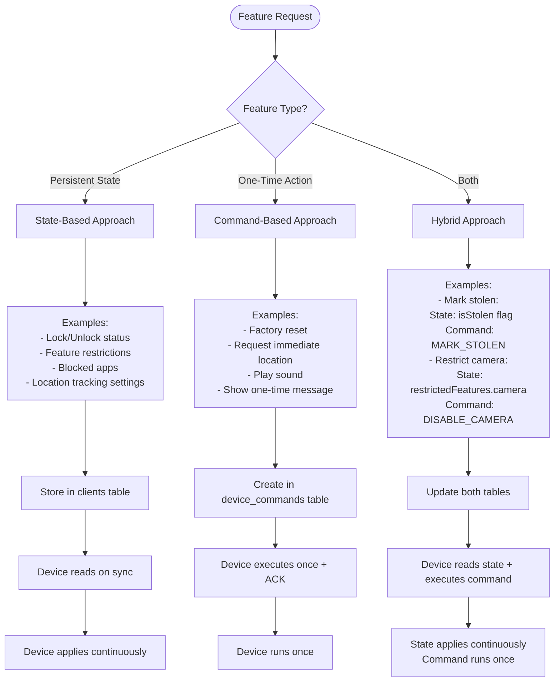

# Device Control System - Complete Flows

## Flow 1: Lock Device for Payment Overdue

---

## Flow 2: Mark Device as Stolen + Aggressive Tracking

---

## Flow 3: Restrict Features (Camera + Apps)

---

## Flow 4: Request Immediate Location

---

## Flow 5: Factory Reset (Emergency)

---

## State Transition Diagram

---

## Decision Tree: Which Approach for Each Feature?

---

## Summary

### Use State-Based For:
- ✅ Lock/unlock status
- ✅ Feature restrictions (camera, WiFi, etc.)
- ✅ App blocking
- ✅ Location tracking settings
- ✅ Permissions (install apps, modify settings)
- ✅ Network restrictions
- ✅ Time restrictions

**Why:** These are persistent settings that should be enforced continuously.

### Use Command-Based For:
- ✅ Factory reset
- ✅ Request immediate location
- ✅ Play sound
- ✅ Show message
- ✅ Take screenshot
- ✅ Wipe specific data

**Why:** These are one-time actions that need audit trail and execution confirmation.

### Use Hybrid For:
- ✅ Mark/unmark stolen (state + command for audit)
- ✅ Major restriction changes (state + command for logging)
- ✅ Critical actions (state + command for compliance)

**Why:** Need both persistent state and audit trail for legal/compliance reasons.
