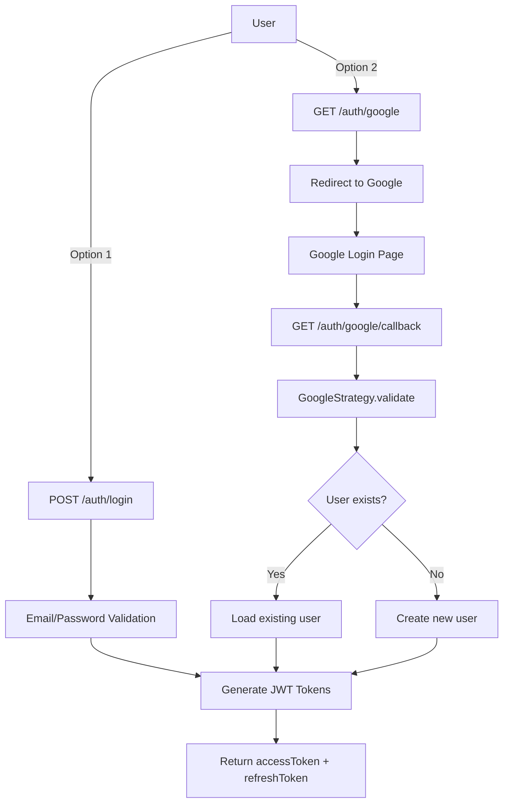

# Google OAuth2 Integration Guide

## Overview

Your NestJS backend now supports **two authentication methods**:

1. **Traditional Email/Password** - JWT-based authentication
2. **Google OAuth2** - "Sign in with Google"

Both methods generate the same JWT tokens, so your frontend can handle them identically.

---

## Architecture



---

## Setup Steps

### 1. Install Dependencies

```bash
pnpm add passport-google-oauth20
pnpm add -D @types/passport-google-oauth20
```

### 2. Get Google OAuth Credentials

1. Go to [Google Cloud Console](https://console.cloud.google.com/)
2. Create a new project or select existing
3. Enable **Google+ API**
4. Go to **Credentials** → **Create Credentials** → **OAuth 2.0 Client ID**
5. Configure consent screen
6. Set **Authorized redirect URIs**: `http://localhost:3000/api/v1/auth/google/callback`
7. Copy **Client ID** and **Client Secret**

### 3. Update `.env`

```env
# Google OAuth
GOOGLE_CLIENT_ID=123456789-abcdefg.apps.googleusercontent.com
GOOGLE_CLIENT_SECRET=GOCSPX-abc123def456
GOOGLE_CALLBACK_URL=http://localhost:3000/api/v1/auth/google/callback
```

### 4. Database Migration

Since we added `googleId` field to the User entity, run migration:

```bash
# Generate migration
npm run migration:generate -- -n AddGoogleIdToAgent

# Run migration
npm run migration:run
```

Or if using `synchronize: true` in development, just restart the server.

---

## How It Works

### Flow 1: Traditional Login

```typescript
POST /api/v1/auth/login
Content-Type: application/json

{
  "email": "user@company.com",
  "password": "SecurePass123"
}

Response:
{
  "accessToken": "eyJhbGciOiJIUzI1NiIsInR5cCI6IkpXVCJ9...",
  "refreshToken": "eyJhbGciOiJIUzI1NiIsInR5cCI6IkpXVCJ9...",
  "user": {
    "id": "uuid",
    "name": "John Doe",
    "email": "user@company.com",
    "role": "AGENT"
  }
}
```

### Flow 2: Google OAuth

**Step 1**: Frontend redirects user to:
```
GET http://localhost:3000/api/v1/auth/google
```

**Step 2**: User is redirected to Google login page

**Step 3**: After successful login, Google redirects to:
```
GET http://localhost:3000/api/v1/auth/google/callback?code=...
```

**Step 4**: Backend processes the callback:
- `GoogleStrategy.validate()` is called
- Checks if user with this email exists
  - **Exists**: Load user, update `googleId` if missing
  - **Doesn't exist**: Create new user (auto-registration)
- Generate JWT tokens
- Set HTTP-only cookies with tokens
- Redirect to frontend dashboard

---

## Frontend Integration

### React Example

```typescript
// Login button
function LoginPage() {
  const handleGoogleLogin = () => {
    // Simply redirect to backend OAuth endpoint
    window.location.href = 'http://localhost:3000/api/v1/auth/google';
  };

  return (
    <div>
      <button onClick={handleGoogleLogin}>
        Sign in with Google
      </button>
    </div>
  );
}

// Dashboard (after redirect)
function Dashboard() {
  useEffect(() => {
    // Tokens are in HTTP-only cookies
    // Your axios/fetch will automatically include them
    fetch('http://localhost:3000/api/v1/agents/profile', {
      credentials: 'include', // Important!
    })
      .then(res => res.json())
      .then(data => console.log(data));
  }, []);
}
```

### Alternative: Token in URL (Less Secure)

If you prefer tokens in URL instead of cookies, modify [auth.controller.ts:57](src/modules/auth/auth.controller.ts#L57):

```typescript
// Instead of setting cookies, redirect with tokens in URL
const frontendUrl = `http://localhost:5173/auth/callback?access_token=${tokens.accessToken}&refresh_token=${tokens.refreshToken}`;
return res.redirect(frontendUrl);
```

Then extract tokens from URL in your frontend.

---

## Security Considerations

### Auto-Registration

Currently, `GoogleStrategy` auto-creates agents if they don't exist. You may want to:

1. **Disable auto-registration**: Only allow existing agents to login via Google
2. **Require company selection**: New agents must select/create a company
3. **Email domain restriction**: Only allow `@yourcompany.com` emails

```typescript
// In google.strategy.ts
if (!user) {
  // Option 1: Reject new users
  throw new UnauthorizedException('Please contact admin to create account');

  // Option 2: Create but require company setup
  user = await this.agentRepository.save({
    email,
    name: displayName,
    googleId: id,
    // companyId: null, // Force them to join/create company
  });
}
```

### Password Field

After Google OAuth integration:
- `password` field is now **nullable** in User entity
- Agents with `googleId` have `password = null`
- If user tries traditional login with Google account: reject or force password reset

---

## API Endpoints Summary

| Endpoint | Method | Auth | Description |
|----------|--------|------|-------------|
| `/auth/login` | POST | Public | Traditional email/password login |
| `/auth/google` | GET | Public | Initiates Google OAuth flow |
| `/auth/google/callback` | GET | Public | Google OAuth callback (auto-handled) |

---

## Files Modified/Created

### Created:
- ✅ `src/modules/auth/strategies/google.strategy.ts`
- ✅ `src/common/guards/google-auth.guard.ts`

### Modified:
- ✅ `src/modules/user/entities/user.entity.ts` - Added `googleId` field, made `password` nullable
- ✅ `src/modules/auth/auth.module.ts` - Added `GoogleStrategy` to providers
- ✅ `src/modules/auth/auth.controller.ts` - Added `/google` and `/google/callback` routes
- ✅ `src/modules/auth/auth.service.ts` - Extracted `generateTokens()` method

---

## Testing

### 1. Test Traditional Login (should still work)
```bash
curl -X POST http://localhost:3000/api/v1/auth/login \
  -H "Content-Type: application/json" \
  -d '{"email":"test@test.com","password":"password123"}'
```

### 2. Test Google OAuth
```bash
# Open in browser
http://localhost:3000/api/v1/auth/google
```

You should be redirected to Google login, then back to your frontend with tokens set.

---

## Common Issues

### Issue 1: "Redirect URI mismatch"
- **Cause**: Google OAuth redirect URI doesn't match
- **Fix**: Ensure `GOOGLE_CALLBACK_URL` matches exactly what's in Google Console

### Issue 2: "Error: Cannot set headers after they are sent"
- **Cause**: Trying to return data after `res.redirect()`
- **Fix**: Use `return res.redirect()` not `res.redirect(); return {...}`

### Issue 3: CORS errors on callback
- **Cause**: Frontend domain not in CORS whitelist
- **Fix**: Add to `main.ts`:
```typescript
app.enableCors({
  origin: 'http://localhost:5173',
  credentials: true,
});
```

---

## Next Steps

- [ ] Set up Google Cloud Project and get credentials
- [ ] Add `.env` variables
- [ ] Run database migration
- [ ] Test Google login flow
- [ ] Update frontend to add "Sign in with Google" button
- [ ] Decide on auto-registration policy
- [ ] Consider adding more OAuth providers (GitHub, Facebook, etc.)

---

## Additional OAuth Providers

The same pattern works for other providers:

- **GitHub**: `passport-github2`
- **Facebook**: `passport-facebook`
- **Microsoft**: `passport-microsoft`

Just create a new strategy file and add routes!
