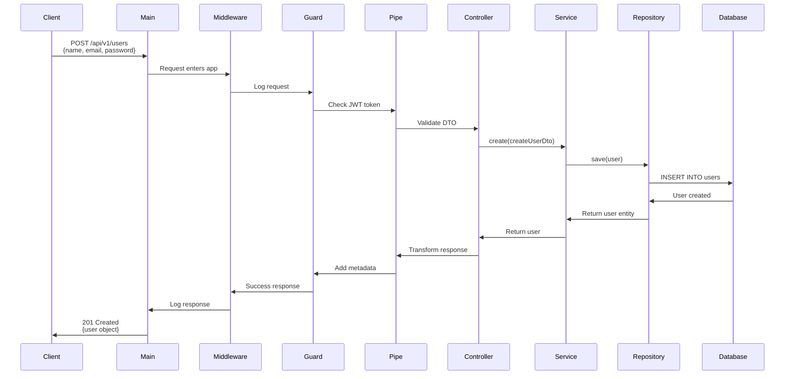
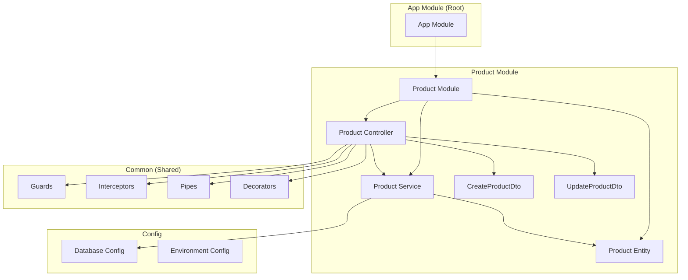

# NestJS Guide for Express Developers

## 🔄 Express vs NestJS - Quick Comparison

| Express | NestJS | Purpose |
|---------|--------|---------|
| `app.js` | `main.ts` | Application entry point |
| Routes folder | Controllers | Handle HTTP requests |
| Route handlers | Controller methods | Handle specific endpoints |
| Middleware | Middleware/Guards/Interceptors | Request processing |
| - | Services | Business logic |
| - | DTOs | Request/Response validation |
| Mongoose models | Entities | Database models |
| - | Modules | Feature organization |
| Manual validation | Pipes | Automatic validation |

---

## 📁 Folder Structure Explained

### Express Way (Typical)
```
express-app/
├── routes/
│   ├── users.js        // Route definitions
│   └── posts.js
├── controllers/
│   ├── userController.js   // Business logic
│   └── postController.js
├── models/
│   ├── User.js         // Database models
│   └── Post.js
├── middleware/
│   └── auth.js         // Authentication
└── app.js              // Main file
```

### NestJS Way (Modular)
```
nest-app/
├── src/
│   ├── modules/
│   │   ├── user/
│   │   │   ├── user.module.ts      // Feature container
│   │   │   ├── user.controller.ts  // Routes + handlers
│   │   │   ├── user.service.ts     // Business logic
│   │   │   ├── entities/
│   │   │   │   └── user.entity.ts  // Database model
│   │   │   └── dto/
│   │   │       ├── create-user.dto.ts  // Request validation
│   │   │       └── update-user.dto.ts
│   │   └── post/
│   │       └── ... (same structure)
│   ├── common/
│   │   ├── guards/         // Auth, permissions
│   │   ├── interceptors/   // Response transformation
│   │   ├── pipes/          // Validation
│   │   └── decorators/     // Custom decorators
│   ├── config/             // Configuration
│   ├── app.module.ts       // Root module
│   └── main.ts             // Entry point
```

---

## 🧩 Core Concepts Explained

### 1. **Module** (Feature Container)

**Express equivalent**: No direct equivalent, like grouping related routes/controllers

**What it is**: A class that bundles related components (controllers, services, etc.)

**Example**:
```typescript
// user.module.ts
import { Module } from '@nestjs/common';
import { TypeOrmModule } from '@nestjs/typeorm';
import { UserController } from './user.controller';
import { UserService } from './user.service';
import { User } from './entities/user.entity';

@Module({
  imports: [
    TypeOrmModule.forFeature([User]), // Register entities
  ],
  controllers: [UserController],     // HTTP endpoints
  providers: [UserService],          // Business logic
  exports: [UserService],            // Share with other modules
})
export class UserModule {}
```

**Key points**:
- `imports`: Other modules this module needs
- `controllers`: Handle HTTP requests
- `providers`: Services, repositories, utilities
- `exports`: What other modules can use

---

### 2. **Controller** (Route Handler)

**Express equivalent**: Route handlers

**Express way**:
```javascript
// Express
router.get('/users', (req, res) => {
  const users = await userService.findAll();
  res.json(users);
});

router.post('/users', (req, res) => {
  const user = await userService.create(req.body);
  res.json(user);
});
```

**NestJS way**:
```typescript
// user.controller.ts
import { Controller, Get, Post, Body } from '@nestjs/common';
import { UserService } from './user.service';
import { CreateUserDto } from './dto/create-user.dto';

@Controller('users')  // Base route: /users
export class UserController {
  constructor(private readonly userService: UserService) {}

  @Get()  // GET /users
  async findAll() {
    return this.userService.findAll();
  }

  @Post()  // POST /users
  async create(@Body() createUserDto: CreateUserDto) {
    return this.userService.create(createUserDto);
  }

  @Get(':id')  // GET /users/:id
  async findOne(@Param('id') id: string) {
    return this.userService.findOne(id);
  }
}
```

**Key decorators**:
- `@Controller('path')`: Defines base route
- `@Get()`, `@Post()`, `@Put()`, `@Delete()`: HTTP methods
- `@Body()`: Access request body
- `@Param('id')`: Access route parameters
- `@Query()`: Access query parameters
- `@Headers()`: Access headers

---

### 3. **Service** (Business Logic)

**Express equivalent**: Controller logic or separate service files

**What it is**: Where you put your business logic (separated from HTTP handling)

```typescript
// user.service.ts
import { Injectable } from '@nestjs/common';
import { InjectRepository } from '@nestjs/typeorm';
import { Repository } from 'typeorm';
import { User } from './entities/user.entity';
import { CreateUserDto } from './dto/create-user.dto';

@Injectable()  // Makes it available for dependency injection
export class UserService {
  constructor(
    @InjectRepository(User)
    private userRepository: Repository<User>,
  ) {}

  async findAll(): Promise<User[]> {
    return this.userRepository.find();
  }

  async findOne(id: string): Promise<User> {
    return this.userRepository.findOne({ where: { id } });
  }

  async create(createUserDto: CreateUserDto): Promise<User> {
    const user = this.userRepository.create(createUserDto);
    return this.userRepository.save(user);
  }

  async remove(id: string): Promise<void> {
    await this.userRepository.delete(id);
  }
}
```

**Why separate?**
- Controllers handle HTTP
- Services handle business logic
- Easy to test services independently
- Can reuse services in multiple controllers

---

### 4. **Entity** (Database Model)

**Express equivalent**: Mongoose Schema or Sequelize Model

**Mongoose way**:
```javascript
const userSchema = new mongoose.Schema({
  name: String,
  email: { type: String, unique: true },
  createdAt: { type: Date, default: Date.now }
});
```

**NestJS/TypeORM way**:
```typescript
// entities/user.entity.ts
import { Entity, PrimaryGeneratedColumn, Column, CreateDateColumn } from 'typeorm';

@Entity('users')  // Table name
export class User {
  @PrimaryGeneratedColumn('uuid')
  id: string;

  @Column()
  name: string;

  @Column({ unique: true })
  email: string;

  @CreateDateColumn()
  createdAt: Date;
}
```

**Key decorators**:
- `@Entity('table_name')`: Marks as database table
- `@PrimaryGeneratedColumn()`: Auto-generated ID
- `@Column()`: Database column
- `@CreateDateColumn()`: Auto timestamp
- `@ManyToOne()`, `@OneToMany()`: Relations

---

### 5. **DTO** (Data Transfer Object)

**Express equivalent**: Manual validation or using libraries like Joi

**What it is**: Defines the shape and validation of incoming/outgoing data

**Express way**:
```javascript
// Manual validation
if (!req.body.email || !req.body.password) {
  return res.status(400).json({ error: 'Email and password required' });
}
```

**NestJS way**:
```typescript
// dto/create-user.dto.ts
import { IsEmail, IsString, MinLength } from 'class-validator';
import { ApiProperty } from '@nestjs/swagger';

export class CreateUserDto {
  @ApiProperty({ example: 'John Doe' })
  @IsString()
  name: string;

  @ApiProperty({ example: 'john@example.com' })
  @IsEmail()
  email: string;

  @ApiProperty({ example: 'Password123!' })
  @IsString()
  @MinLength(8)
  password: string;
}
```

**Auto-validation happens** when you use `@Body()` in controller:
```typescript
@Post()
async create(@Body() createUserDto: CreateUserDto) {
  // If validation fails, NestJS automatically returns 400
  return this.userService.create(createUserDto);
}
```

---

### 6. **Guards** (Authentication/Authorization)

**Express equivalent**: Authentication middleware

**Express way**:
```javascript
const authMiddleware = (req, res, next) => {
  const token = req.headers.authorization;
  if (!token) return res.status(401).json({ error: 'Unauthorized' });
  // Verify token...
  next();
};

router.get('/protected', authMiddleware, handler);
```

**NestJS way**:
```typescript
// guards/jwt-auth.guard.ts
import { Injectable, CanActivate, ExecutionContext } from '@nestjs/common';

@Injectable()
export class JwtAuthGuard implements CanActivate {
  canActivate(context: ExecutionContext): boolean {
    const request = context.switchToHttp().getRequest();
    const token = request.headers.authorization;

    if (!token) {
      throw new UnauthorizedException();
    }

    // Verify token...
    return true;
  }
}

// Usage in controller
@Controller('users')
@UseGuards(JwtAuthGuard)  // Apply to all routes
export class UserController {
  @Get()
  findAll() { ... }
}
```

---

### 7. **Interceptors** (Response Transformation)

**Express equivalent**: Middleware for response modification

**What it does**: Transform responses, add logging, handle errors

```typescript
// interceptors/transform.interceptor.ts
import { Injectable, NestInterceptor, ExecutionContext, CallHandler } from '@nestjs/common';
import { map } from 'rxjs/operators';

@Injectable()
export class TransformInterceptor implements NestInterceptor {
  intercept(context: ExecutionContext, next: CallHandler) {
    return next.handle().pipe(
      map(data => ({
        success: true,
        data,
        timestamp: new Date().toISOString(),
      })),
    );
  }
}

// Before interceptor:
{ id: 1, name: 'John' }

// After interceptor:
{
  success: true,
  data: { id: 1, name: 'John' },
  timestamp: '2024-01-01T00:00:00.000Z'
}
```

---

### 8. **Pipes** (Validation & Transformation)

**Express equivalent**: Custom validation middleware

**Built-in pipes**:
- `ValidationPipe`: Auto-validates DTOs
- `ParseIntPipe`: Converts string to integer
- `ParseUUIDPipe`: Validates UUID format

```typescript
@Get(':id')
async findOne(@Param('id', ParseUUIDPipe) id: string) {
  // ParseUUIDPipe validates that id is a valid UUID
  // If not, automatically returns 400 error
  return this.userService.findOne(id);
}
```

---

### 9. **Middleware** (Request Processing)

**Express equivalent**: Exactly the same!

```typescript
// middleware/logger.middleware.ts
import { Injectable, NestMiddleware } from '@nestjs/common';
import { Request, Response, NextFunction } from 'express';

@Injectable()
export class LoggerMiddleware implements NestMiddleware {
  use(req: Request, res: Response, next: NextFunction) {
    console.log(`${req.method} ${req.url}`);
    next();
  }
}

// Apply in module
export class AppModule {
  configure(consumer: MiddlewareConsumer) {
    consumer
      .apply(LoggerMiddleware)
      .forRoutes('*');
  }
}
```

---

### 10. **Decorators** (Custom Annotations)

**Express equivalent**: No direct equivalent

**What they are**: Functions that add metadata or modify behavior

```typescript
// decorators/current-user.decorator.ts
import { createParamDecorator, ExecutionContext } from '@nestjs/common';

export const CurrentUser = createParamDecorator(
  (data: unknown, ctx: ExecutionContext) => {
    const request = ctx.switchToHttp().getRequest();
    return request.user;
  },
);

// Usage
@Get('profile')
async getProfile(@CurrentUser() user: User) {
  // user is automatically extracted from request
  return user;
}
```

---

## 🌊 Data Flow Example

Let's trace a complete request: `POST /api/v1/users`



### Step-by-Step Flow

1. **Request arrives** → `main.ts`
   ```typescript
   // main.ts
   const app = await NestFactory.create(AppModule);
   app.setGlobalPrefix('api/v1');  // All routes start with /api/v1
   ```

2. **Middleware runs** → Logging, CORS, etc.
   ```typescript
   // Applied globally or per-route
   ```

3. **Guard checks** → Authentication
   ```typescript
   @UseGuards(JwtAuthGuard)
   ```

4. **Pipe validates** → DTO validation
   ```typescript
   @Post()
   create(@Body() createUserDto: CreateUserDto) {
     // Validation happens automatically here
   }
   ```

5. **Controller receives** → Calls service
   ```typescript
   return this.userService.create(createUserDto);
   ```

6. **Service executes** → Business logic
   ```typescript
   const user = this.userRepository.create(createUserDto);
   return this.userRepository.save(user);
   ```

7. **Repository saves** → Database operation
   ```typescript
   // TypeORM handles SQL
   INSERT INTO users (name, email, password) VALUES (...)
   ```

8. **Response flows back** → Through interceptors
   ```typescript
   // Interceptor transforms response
   { success: true, data: user }
   ```

---

## 🔨 Creating a New Module - Complete Example

Let's create a **Product** module from scratch:

### Step 1: Generate Module Files

```bash
# Generate module (creates folder + files)
nest g module modules/product
nest g controller modules/product
nest g service modules/product
```

### Step 2: Create Entity

```typescript
// modules/product/entities/product.entity.ts
import { Entity, PrimaryGeneratedColumn, Column, CreateDateColumn } from 'typeorm';

@Entity('products')
export class Product {
  @PrimaryGeneratedColumn('uuid')
  id: string;

  @Column()
  name: string;

  @Column('decimal', { precision: 10, scale: 2 })
  price: number;

  @Column({ default: 0 })
  stock: number;

  @CreateDateColumn()
  createdAt: Date;
}
```

### Step 3: Create DTOs

```typescript
// modules/product/dto/create-product.dto.ts
import { IsString, IsNumber, Min } from 'class-validator';
import { ApiProperty } from '@nestjs/swagger';

export class CreateProductDto {
  @ApiProperty({ example: 'iPhone 15' })
  @IsString()
  name: string;

  @ApiProperty({ example: 999.99 })
  @IsNumber()
  @Min(0)
  price: number;

  @ApiProperty({ example: 100 })
  @IsNumber()
  @Min(0)
  stock: number;
}

// modules/product/dto/update-product.dto.ts
import { PartialType } from '@nestjs/swagger';
import { CreateProductDto } from './create-product.dto';

export class UpdateProductDto extends PartialType(CreateProductDto) {}
// Makes all fields optional
```

### Step 4: Implement Service

```typescript
// modules/product/product.service.ts
import { Injectable, NotFoundException } from '@nestjs/common';
import { InjectRepository } from '@nestjs/typeorm';
import { Repository } from 'typeorm';
import { Product } from './entities/product.entity';
import { CreateProductDto } from './dto/create-product.dto';
import { UpdateProductDto } from './dto/update-product.dto';

@Injectable()
export class ProductService {
  constructor(
    @InjectRepository(Product)
    private productRepository: Repository<Product>,
  ) {}

  async create(createProductDto: CreateProductDto): Promise<Product> {
    const product = this.productRepository.create(createProductDto);
    return this.productRepository.save(product);
  }

  async findAll(): Promise<Product[]> {
    return this.productRepository.find();
  }

  async findOne(id: string): Promise<Product> {
    const product = await this.productRepository.findOne({ where: { id } });
    if (!product) {
      throw new NotFoundException(`Product with ID ${id} not found`);
    }
    return product;
  }

  async update(id: string, updateProductDto: UpdateProductDto): Promise<Product> {
    await this.productRepository.update(id, updateProductDto);
    return this.findOne(id);
  }

  async remove(id: string): Promise<void> {
    const result = await this.productRepository.delete(id);
    if (result.affected === 0) {
      throw new NotFoundException(`Product with ID ${id} not found`);
    }
  }
}
```

### Step 5: Implement Controller

```typescript
// modules/product/product.controller.ts
import {
  Controller,
  Get,
  Post,
  Put,
  Delete,
  Body,
  Param,
  UseGuards,
} from '@nestjs/common';
import { ApiTags, ApiBearerAuth, ApiOperation } from '@nestjs/swagger';
import { ProductService } from './product.service';
import { CreateProductDto } from './dto/create-product.dto';
import { UpdateProductDto } from './dto/update-product.dto';
import { JwtAuthGuard } from '../../common/guards/jwt-auth.guard';

@ApiTags('products')
@Controller('products')
@UseGuards(JwtAuthGuard)  // Protect all routes
@ApiBearerAuth()
export class ProductController {
  constructor(private readonly productService: ProductService) {}

  @Post()
  @ApiOperation({ summary: 'Create a new product' })
  create(@Body() createProductDto: CreateProductDto) {
    return this.productService.create(createProductDto);
  }

  @Get()
  @ApiOperation({ summary: 'Get all products' })
  findAll() {
    return this.productService.findAll();
  }

  @Get(':id')
  @ApiOperation({ summary: 'Get product by ID' })
  findOne(@Param('id') id: string) {
    return this.productService.findOne(id);
  }

  @Put(':id')
  @ApiOperation({ summary: 'Update product' })
  update(
    @Param('id') id: string,
    @Body() updateProductDto: UpdateProductDto,
  ) {
    return this.productService.update(id, updateProductDto);
  }

  @Delete(':id')
  @ApiOperation({ summary: 'Delete product' })
  remove(@Param('id') id: string) {
    return this.productService.remove(id);
  }
}
```

### Step 6: Configure Module

```typescript
// modules/product/product.module.ts
import { Module } from '@nestjs/common';
import { TypeOrmModule } from '@nestjs/typeorm';
import { ProductController } from './product.controller';
import { ProductService } from './product.service';
import { Product } from './entities/product.entity';

@Module({
  imports: [
    TypeOrmModule.forFeature([Product]),  // Register entity
  ],
  controllers: [ProductController],
  providers: [ProductService],
  exports: [ProductService],  // Allow other modules to use ProductService
})
export class ProductModule {}
```

### Step 7: Register in App Module

```typescript
// app.module.ts
import { Module } from '@nestjs/common';
import { ProductModule } from './modules/product/product.module';

@Module({
  imports: [
    // ... other imports
    ProductModule,  // Add your new module here
  ],
})
export class AppModule {}
```

---

## 📊 Module Architecture Diagram



---

## 🎯 Quick Reference: When to Use What

| Need | Use | Example |
|------|-----|---------|
| HTTP endpoint | Controller | `@Get('users')` |
| Business logic | Service | `userService.findAll()` |
| Database model | Entity | `@Entity('users')` |
| Validate input | DTO | `CreateUserDto` |
| Authentication | Guard | `JwtAuthGuard` |
| Transform response | Interceptor | `TransformInterceptor` |
| Log requests | Middleware | `LoggerMiddleware` |
| Reusable decorator | Decorator | `@CurrentUser()` |
| Group features | Module | `UserModule` |
| Configuration | Config | `ConfigService` |

---

## 💡 Best Practices

1. **One responsibility per file**
   - Controller: HTTP handling only
   - Service: Business logic only
   - Entity: Database schema only

2. **Module structure**
   ```
   user/
   ├── dto/              # All DTOs
   ├── entities/         # All entities
   ├── user.controller.ts
   ├── user.service.ts
   ├── user.module.ts
   └── user.spec.ts      # Tests
   ```

3. **Naming conventions**
   - Controller: `user.controller.ts` → `UserController`
   - Service: `user.service.ts` → `UserService`
   - Module: `user.module.ts` → `UserModule`
   - DTO: `create-user.dto.ts` → `CreateUserDto`

4. **Dependency injection**
   ```typescript
   // Always inject dependencies via constructor
   constructor(
     private readonly userService: UserService,
     private readonly configService: ConfigService,
   ) {}
   ```

5. **Error handling**
   ```typescript
   // Use built-in exceptions
   throw new NotFoundException('User not found');
   throw new BadRequestException('Invalid data');
   throw new UnauthorizedException('Invalid credentials');
   ```

---

## 🔍 Debugging Tips

```typescript
// 1. Enable logging
const app = await NestFactory.create(AppModule, {
  logger: ['error', 'warn', 'debug', 'log', 'verbose'],
});

// 2. Log in services
@Injectable()
export class UserService {
  private readonly logger = new Logger(UserService.name);

  async findAll() {
    this.logger.log('Finding all users');
    return this.userRepository.find();
  }
}

// 3. Use interceptor for request/response logging
```

---

This guide covers the essential concepts! The key difference from Express is that NestJS enforces **structure and modularity**, making large applications easier to maintain. Start with simple CRUD operations and gradually add guards, interceptors, and other features as needed.
